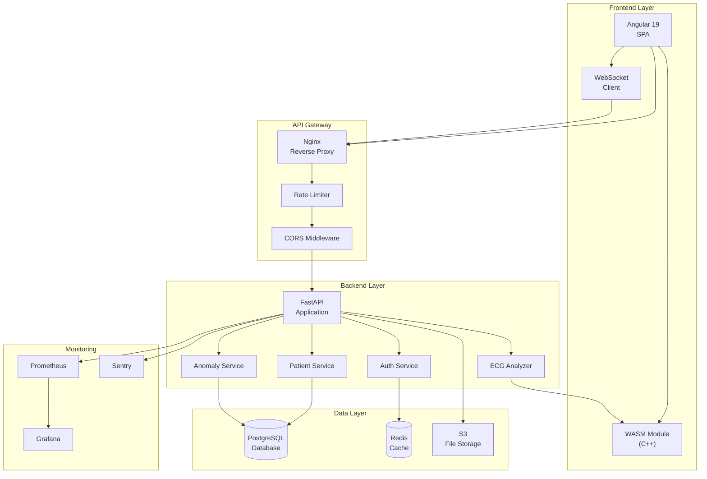
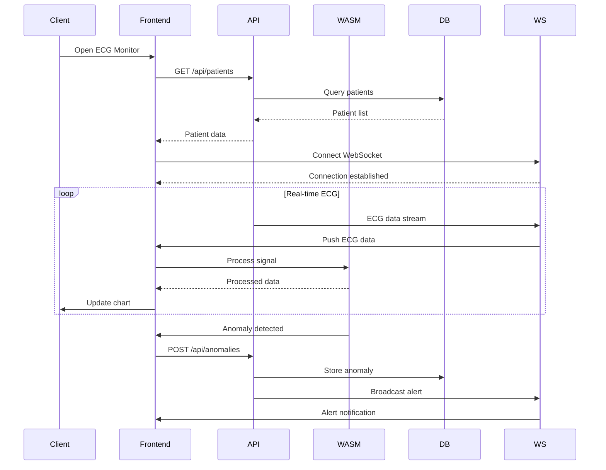
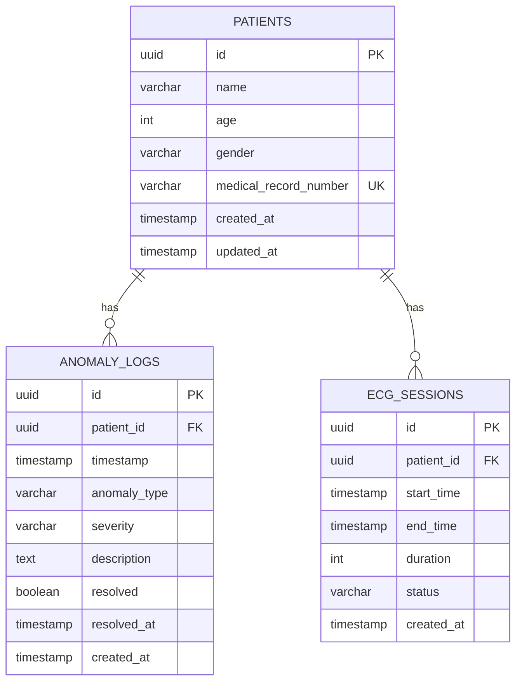
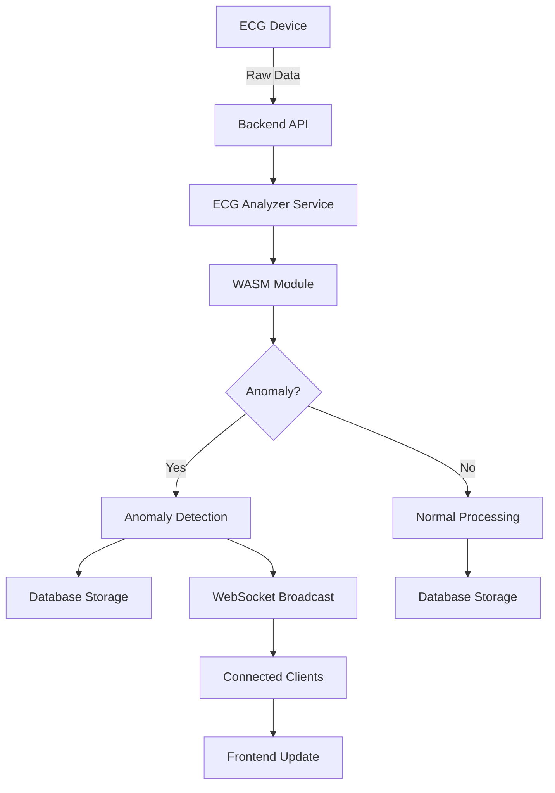
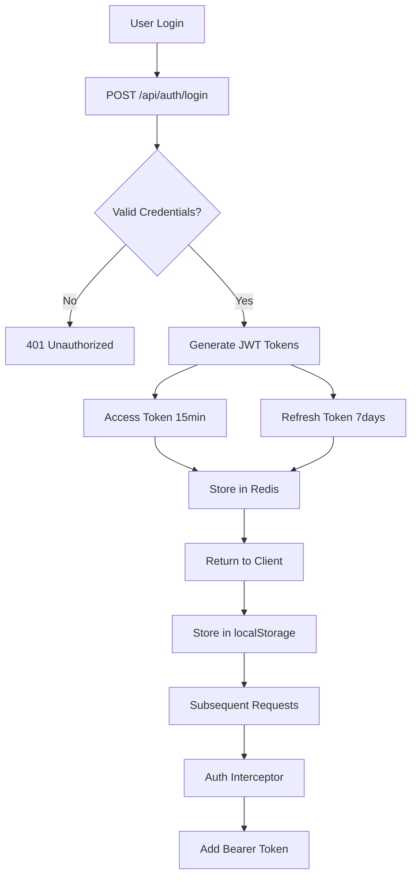
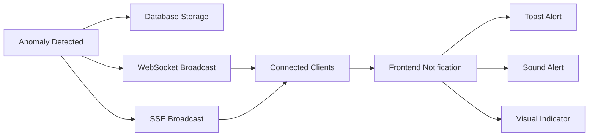
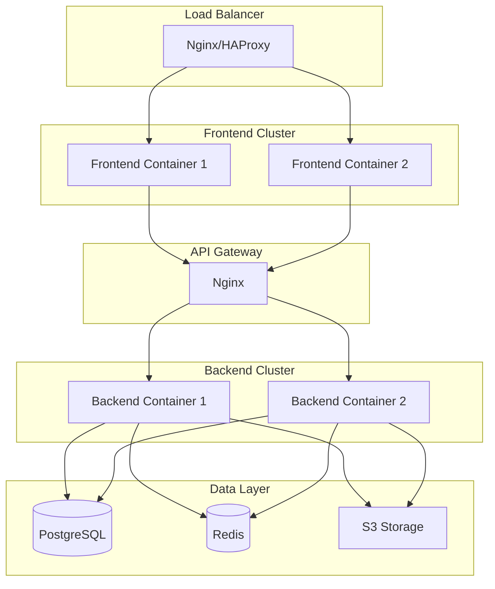
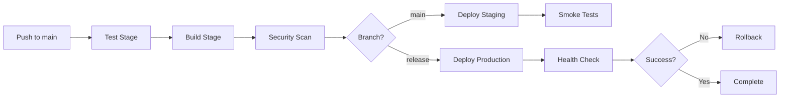

# VitalStream Architecture Documentation

## 📋 Table of Contents

1. [System Overview](#system-overview)
2. [Architecture Diagram](#architecture-diagram)
3. [Component Details](#component-details)
4. [Data Flow](#data-flow)
5. [Technology Stack](#technology-stack)
6. [Design Patterns](#design-patterns)
7. [Security Architecture](#security-architecture)
8. [Performance Optimization](#performance-optimization)
9. [Deployment Architecture](#deployment-architecture)

---

## 🎯 System Overview

VitalStream is a real-time ECG monitoring and anomaly detection system designed for healthcare environments. The system processes ECG data streams, detects anomalies using WebAssembly-accelerated algorithms, and provides real-time alerts to medical professionals.

### Key Features

- **Real-time ECG Monitoring**: Live ECG waveform visualization
- **Anomaly Detection**: ML-powered anomaly detection using WASM
- **Multi-patient Support**: Monitor multiple patients simultaneously
- **Alert System**: Real-time alerts via WebSocket and SSE
- **Historical Analysis**: Patient history and trend analysis
- **Report Generation**: PDF report generation
- **Role-based Access**: Secure authentication and authorization

---

## 🏗️ Architecture Diagram

### High-Level Architecture



### Component Interaction



---

## 🔧 Component Details

### Frontend Components

#### 1. **Angular Application**
- **Location**: `frontend/src/app/`
- **Purpose**: Single-page application for ECG monitoring
- **Key Components**:
  - `ECGChartComponent`: Real-time ECG waveform visualization
  - `PatientListComponent`: Patient management interface
  - `AnomalyListComponent`: Anomaly alerts and history
  - `DashboardComponent`: Multi-patient overview

#### 2. **WASM Module**
- **Location**: `wasm/`
- **Purpose**: High-performance ECG signal processing
- **Language**: C++
- **Key Functions**:
  - `process_ecg_data()`: ECG signal filtering and processing
  - `detect_anomalies()`: Real-time anomaly detection
  - `calculate_metrics()`: Heart rate, QRS detection, etc.

#### 3. **Services**
- **ECGDataService**: ECG data management and streaming
- **WasmLoaderService**: WASM module loading and initialization
- **WebSocketService**: Real-time communication
- **AuthService**: Authentication and token management

### Backend Components

#### 1. **API Layer**
- **Location**: `backend/app/api/`
- **Framework**: FastAPI
- **Endpoints**:
  - `/api/auth/*`: Authentication endpoints
  - `/api/patients/*`: Patient management
  - `/api/anomalies/*`: Anomaly detection and alerts
  - `/api/reports/*`: Report generation
  - `/ws/ecg`: WebSocket endpoint for real-time data
  - `/sse/events`: Server-Sent Events for notifications

#### 2. **Service Layer**
- **Location**: `backend/app/services/`
- **Components**:
  - `PatientService`: Patient business logic
  - `AnomalyService`: Anomaly detection and management
  - `ECGAnalyzer`: ECG signal analysis
  - `ReportService`: PDF report generation

#### 3. **Repository Layer**
- **Location**: `backend/app/repositories/`
- **Pattern**: Repository pattern for data access
- **Components**:
  - `PatientRepository`: Patient data access
  - `AnomalyRepository`: Anomaly data access
  - `SessionRepository`: Session management

#### 4. **Middleware**
- **Location**: `backend/app/middleware.py`
- **Components**:
  - `SecurityHeadersMiddleware`: Security headers (CSP, HSTS, etc.)
  - `RequestLoggingMiddleware`: Request/response logging
  - `RateLimitMiddleware`: Rate limiting
  - `ExceptionHandlerMiddleware`: Global error handling

### Database Schema



#### Indexes

```sql
-- Anomaly logs indexes
CREATE INDEX idx_anomaly_patient_id ON anomaly_logs(patient_id);
CREATE INDEX idx_anomaly_timestamp ON anomaly_logs(timestamp DESC);
CREATE INDEX idx_anomaly_severity ON anomaly_logs(severity);
CREATE INDEX idx_anomaly_resolved ON anomaly_logs(resolved);
CREATE INDEX idx_anomaly_composite ON anomaly_logs(patient_id, timestamp DESC, severity);

-- Patient indexes
CREATE INDEX idx_patient_mrn ON patients(medical_record_number);
CREATE INDEX idx_patient_created ON patients(created_at DESC);

-- Session indexes
CREATE INDEX idx_session_patient_id ON ecg_sessions(patient_id);
CREATE INDEX idx_session_start_time ON ecg_sessions(start_time DESC);
```

---

## 🔄 Data Flow

### 1. ECG Data Processing Flow



### 2. Authentication Flow



### 3. Real-time Alert Flow



---

## 🛠️ Technology Stack

### Frontend

| Technology | Version | Purpose |
|------------|---------|----------|
| Angular | 19.x | Frontend framework |
| TypeScript | 5.x | Type-safe JavaScript |
| RxJS | 7.x | Reactive programming |
| Chart.js | 4.x | ECG visualization |
| WebAssembly | - | High-performance processing |
| Tailwind CSS | 3.x | Styling |
| Playwright | Latest | E2E testing |
| Jasmine/Karma | Latest | Unit testing |

### Backend

| Technology | Version | Purpose |
|------------|---------|----------|
| Python | 3.11+ | Backend language |
| FastAPI | 0.100+ | Web framework |
| SQLAlchemy | 2.x | ORM |
| Pydantic | 2.x | Data validation |
| PyJWT | 2.x | JWT authentication |
| Redis | 7.x | Caching & sessions |
| PostgreSQL | 15+ | Primary database |
| Pytest | Latest | Testing framework |

### WASM

| Technology | Version | Purpose |
|------------|---------|----------|
| C++ | 17+ | WASM source language |
| Emscripten | Latest | WASM build tool |
| Embind | Latest | JS/WASM bindings |

### DevOps

| Technology | Version | Purpose |
|------------|---------|----------|
| Docker | Latest | Containerization |
| Docker Compose | Latest | Multi-container orchestration |
| GitHub Actions | - | CI/CD pipeline |
| Prometheus | Latest | Metrics collection |
| Grafana | Latest | Metrics visualization |
| Nginx | Latest | Reverse proxy |

---

## 🎨 Design Patterns

### 1. Repository Pattern

**Purpose**: Separate data access logic from business logic

**Implementation**:
```python
# backend/app/repositories/patient_repository.py
class PatientRepository:
    """Repository for patient data access operations."""
    
    def __init__(self, db: Session):
        self.db = db
    
    async def get_by_id(self, patient_id: UUID) -> Patient:
        """Retrieve a patient by ID."""
        return await self.db.query(Patient).filter(Patient.id == patient_id).first()
    
    async def create(self, patient: PatientCreate) -> Patient:
        """Create a new patient record."""
        db_patient = Patient(**patient.dict())
        self.db.add(db_patient)
        await self.db.commit()
        return db_patient
```

### 2. Service Layer Pattern

**Purpose**: Encapsulate business logic

**Implementation**:
```python
# backend/app/services/patient_service.py
class PatientService:
    """Service layer for patient business logic."""
    
    def __init__(self, repository: PatientRepository):
        self.repository = repository
    
    async def create_patient(self, patient_data: PatientCreate) -> Patient:
        """Create a new patient with validation."""
        # Business logic here
        return await self.repository.create(patient_data)
```

### 3. Dependency Injection

**Purpose**: Loose coupling and testability

**Implementation**:
```python
# FastAPI dependency injection
@router.post("/patients")
async def create_patient(
    patient: PatientCreate,
    service: PatientService = Depends(get_patient_service)
):
    """Create a new patient endpoint."""
    return await service.create_patient(patient)
```

### 4. Observer Pattern (WebSocket)

**Purpose**: Real-time event broadcasting

**Implementation**:
```python
# backend/app/websocket.py
class ConnectionManager:
    """Manages WebSocket connections and broadcasts."""
    
    def __init__(self):
        self.active_connections: List[WebSocket] = []
    
    async def broadcast(self, message: dict):
        """Broadcast message to all connected clients."""
        for connection in self.active_connections:
            await connection.send_json(message)
```

### 5. Singleton Pattern (WASM Loader)

**Purpose**: Single instance of WASM module

**Implementation**:
```typescript
// frontend/src/app/services/wasm-loader.service.ts
@Injectable({ providedIn: 'root' })
export class WasmLoaderService {
  private static instance: WasmModule;
  
  async loadWasm(): Promise<WasmModule> {
    if (!WasmLoaderService.instance) {
      WasmLoaderService.instance = await import('../../wasm/pkg');
    }
    return WasmLoaderService.instance;
  }
}
```

---

## 🔒 Security Architecture

### 1. Authentication & Authorization

- **JWT Tokens**: Access token (15 min) + Refresh token (7 days)
- **Token Rotation**: Automatic refresh before expiration
- **Token Blacklist**: Redis-based revocation
- **Password Hashing**: bcrypt with salt

### 2. Security Headers

```python
Content-Security-Policy: default-src 'self'
Strict-Transport-Security: max-age=31536000; includeSubDomains
X-Frame-Options: DENY
X-Content-Type-Options: nosniff
X-XSS-Protection: 1; mode=block
```

### 3. Rate Limiting

- **Global**: 100 requests/minute per IP
- **Auth endpoints**: 5 requests/minute
- **API endpoints**: 60 requests/minute

### 4. Input Validation

- **Pydantic schemas**: Type validation
- **SQL injection**: Parameterized queries (SQLAlchemy)
- **XSS protection**: Content sanitization

---

## ⚡ Performance Optimization

### 1. Frontend Optimizations

- **Lazy Loading**: Route-based code splitting
- **Bundle Size**: Tree shaking, minification
- **Image Optimization**: WebP format, lazy loading
- **WASM**: High-performance signal processing

### 2. Backend Optimizations

- **Database Indexing**: Composite indexes on frequent queries
- **Connection Pooling**: PostgreSQL connection pool (10-20 connections)
- **Caching**: Redis for session data and frequently accessed data
- **Async I/O**: FastAPI async endpoints

### 3. Database Optimizations

- **Indexes**: 9 strategic indexes
- **Query Optimization**: N+1 query prevention
- **Pagination**: Limit/offset for large datasets

---

## 🚀 Deployment Architecture

### Production Environment



### Container Configuration

**Frontend Container**:
- Base: `nginx:alpine`
- Static files served by Nginx
- Gzip compression enabled
- Cache headers configured

**Backend Container**:
- Base: `python:3.11-slim`
- Gunicorn + Uvicorn workers
- Health check endpoint
- Auto-restart on failure

**Database**:
- PostgreSQL 15+ with replication
- Automated backups (daily)
- Point-in-time recovery

---

## 📊 Monitoring & Observability

### Metrics Collection

- **Prometheus**: Metrics scraping (15s interval)
- **Grafana**: Visualization dashboards
- **Alertmanager**: Alert routing and notifications

### Key Metrics

1. **Application Metrics**:
   - Request rate (req/s)
   - Response time (p50, p95, p99)
   - Error rate (%)
   - Active connections

2. **System Metrics**:
   - CPU usage (%)
   - Memory usage (MB)
   - Disk I/O (MB/s)
   - Network I/O (MB/s)

3. **Database Metrics**:
   - Query duration (ms)
   - Connection pool usage
   - Cache hit rate (%)

### Logging

- **Format**: JSON structured logs
- **Levels**: DEBUG, INFO, WARNING, ERROR, CRITICAL
- **Aggregation**: Centralized logging (ELK stack compatible)
- **Retention**: 30 days

---

## 🔄 CI/CD Pipeline

### GitHub Actions Workflow



**Stages**:
1. **Test**: Backend unit tests, frontend unit tests, E2E tests, code coverage
2. **Build**: Docker image build, WASM compilation, frontend production build
3. **Security Scan**: Dependency vulnerability scan, SAST, container image scan
4. **Deploy**: Staging deployment (auto), production deployment (manual approval), rollback mechanism

---

## 📚 Additional Resources

- [API Documentation](./API_DOCUMENTATION.md)
- [Deployment Guide](./DEPLOYMENT.md)
- [Contributing Guidelines](../CONTRIBUTING.md)
- [Real-time Features](./REALTIME_FEATURES.md)

---

**Last Updated**: January 2, 2026  
**Version**: 2.0.0  
**Maintainer**: VitalStream Team
