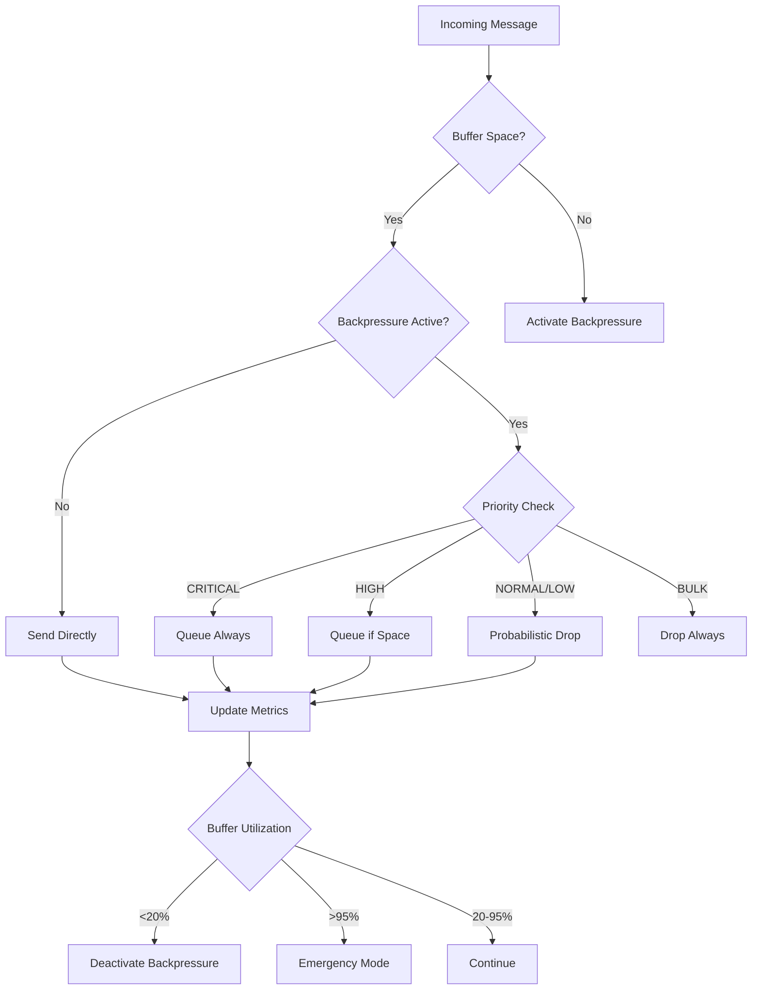

# WebSocket Compression & Backpressure Documentation

## Overview

This document describes the professional implementation of WebSocket compression and backpressure handling for high-frequency ECG data streaming in the VITAL ECG monitoring system.

## Architecture

### Components

1. **WebSocket Compression** (`compression.py`)
   - Per-message deflate compression
   - Adaptive compression levels
   - Performance monitoring
   - ECG data optimization

2. **Backpressure Handler** (`backpressure.py`)
   - Message prioritization
   - Flow control
   - Buffer management
   - Emergency mode handling

3. **Adaptive Compression** (`adaptive_compression.py`)
   - Network condition detection
   - Dynamic optimization
   - Predictive adjustments
   - Performance analytics

## Features

### Compression Features

- **Per-Message Deflate**: Individual message compression with zlib
- **Adaptive Levels**: Dynamic compression level adjustment (1-9)
- **ECG Optimization**: Specialized settings for medical ECG data
- **Performance Monitoring**: Real-time compression metrics
- **Intelligent Thresholding**: Compress only when beneficial (>1KB)

### Backpressure Features

- **5-Level Priority System**: CRITICAL, HIGH, NORMAL, LOW, BULK
- **Intelligent Queuing**: Priority-based message queuing
- **Flow Control**: Rate limiting and congestion detection
- **Emergency Mode**: Critical data preservation under extreme load
- **Graceful Degradation**: Selective message dropping

### Adaptive Features

- **Network Detection**: Automatic network condition assessment
- **Pattern Recognition**: ECG data pattern analysis
- **Predictive Optimization**: ML-based compression level prediction
- **Real-time Adaptation**: Continuous performance optimization

## Configuration

### Compression Settings

```python
# Optimal for ECG medical data
WINDOW_BITS = 12          # 4KB window
MEM_LEVEL = 5             # Balance speed/memory
COMPRESSION_LEVEL = 6     # Default level
COMPRESSION_THRESHOLD = 1024  # Minimum size for compression
```

### Backpressure Settings

```python
MAX_BUFFER_SIZE = 10_000   # Maximum messages
HIGH_WATERMARK = 0.8       # Activate at 80%
LOW_WATERMARK = 0.2        # Deactivate at 20%
CRITICAL_WATERMARK = 0.95  # Emergency at 95%
MAX_RETRIES = 3           # Retry attempts
```

### Priority Quotas

```python
PRIORITY_QUOTAS = {
    MessagePriority.CRITICAL: 0.30,  # 30% buffer
    MessagePriority.HIGH: 0.40,      # 40% buffer
    MessagePriority.NORMAL: 0.20,   # 20% buffer
    MessagePriority.LOW: 0.08,       # 8% buffer
    MessagePriority.BULK: 0.02       # 2% buffer
}
```

## Performance Targets

| Metric | Target | Critical |
|--------|--------|----------|
| Compression Ratio | 80%+ | 70%+ |
| Compression Latency | <10ms | <20ms |
| Decompression Latency | <5ms | <10ms |
| Memory Overhead | <50MB | <100MB |
| Buffer Capacity | 10,000 msgs | 5,000 msgs |
| Message Loss Rate | <0.1% | <1% |
| Throughput | 1,000 msg/s | 500 msg/s |

## Implementation Details

### Message Prioritization

```python
class MessagePriority(IntEnum):
    CRITICAL = 1    # Anomaly alerts, life-threatening arrhythmias
    HIGH = 2        # Real-time ECG data, vital signs
    NORMAL = 3      # Status updates, patient info
    LOW = 4         # Metrics, logs, non-critical data
    BULK = 5        # Historical data, batch processing
```

### Adaptive Algorithm

1. **Monitor Performance**: Track latency, compression ratio, throughput
2. **Detect Conditions**: Analyze network bandwidth and data patterns
3. **Predict Optimal Level**: Use historical data for prediction
4. **Adjust Settings**: Dynamically modify compression parameters
5. **Validate Results**: Monitor impact and fine-tune

### Backpressure Flow



## Usage Examples

### Basic Compression

```python
from backend.app.websocket.compression import get_compression_handler

# Get compression handler
compression = get_compression_handler()

# Compress ECG data
ecg_data = get_ecg_signal()
compressed, metadata = compression.compress(ecg_data)

print(f"Compression ratio: {metadata['compression_ratio']:.1f}%")
print(f"Compression time: {metadata['compression_time_ms']:.2f}ms")
```

### Backpressure Handling

```python
from backend.app.websocket.backpressure import BackpressureHandler, MessagePriority

# Create handler
handler = BackpressureHandler(websocket)

# Send messages with priority
await handler.send_with_backpressure(
    ecg_data, 
    priority=MessagePriority.HIGH
)

# Get metrics
metrics = handler.get_metrics()
print(f"Buffer utilization: {metrics.buffer_utilization:.1%}")
print(f"Drop rate: {metrics.drop_rate:.2%}")
```

### Adaptive Compression

```python
from backend.app.websocket.adaptive_compression import AdaptiveCompression

# Create adaptive system
adaptive = AdaptiveCompression(compression_handler)

# Start monitoring
await adaptive.start_monitoring()

# Compress with adaptation
compressed, metadata = await adaptive.compress_with_adaptation(
    ecg_data,
    metadata={'sample_rate': 250, 'patient_id': '123'}
)

print(f"Adaptive level: {metadata['adaptive_level']}")
print(f"Network condition: {metadata['network_condition']}")
```

## Monitoring and Metrics

### Compression Metrics

```python
stats = compression.get_compression_stats()
# {
#     'current_level': 6,
#     'messages_processed': 1000,
#     'average_compression_ratio': 78.5,
#     'average_latency_ms': 8.2,
#     'space_saved_mb': 15.7
# }
```

### Backpressure Metrics

```python
metrics = handler.get_detailed_metrics()
# {
#     'buffer': {
#         'size': 2500,
#         'utilization': 0.25,
#         'high_watermark': 0.8
#     },
#     'performance': {
#         'sent_messages': 9500,
#         'dropped_messages': 50,
#         'drop_rate': 0.005,
#         'messages_per_second': 850.0
#     },
#     'state': {
#         'backpressure_active': False,
#         'emergency_mode': False,
#         'paused': False
#     }
# }
```

### Adaptive Metrics

```python
stats = adaptive.get_adaptation_stats()
# {
#     'current_level': 6,
#     'network_condition': 'good',
#     'data_pattern': 'normal',
#     'adaptation_count': 15,
#     'performance': {
#         'latency_ms': 7.8,
#         'compression_ratio': 82.3,
#         'throughput_mbps': 5.2
#     }
# }
```

## Testing

### Unit Tests

```bash
# Run compression tests
python -m pytest tests/test_compression.py -v

# Run backpressure tests
python -m pytest tests/test_backpressure.py -v
```

### Load Tests

```python
# High volume test (10,000 messages)
python -m pytest tests/test_backpressure.py::TestBackpressureLoad::test_high_volume_message_processing

# Sustained load test (5 seconds @ 100 msg/s)
python -m pytest tests/test_backpressure.py::TestBackpressureLoad::test_sustained_load
```

### Performance Benchmarks

```python
# Compression benchmark
compression.benchmark_compression(ecg_data, iterations=1000)

# Results:
# - Compression: 8.2ms avg
# - Decompression: 3.1ms avg
# - Compression Ratio: 78.5% avg
# - Throughput: 12.4 Mbps
```

## Troubleshooting

### Common Issues

#### High Compression Latency
- **Cause**: Compression level too high
- **Solution**: Reduce compression level or increase threshold
- **Code**: `compression.optimize_for_ecg_data(sample_rate=500)`

#### High Drop Rate
- **Cause**: Buffer overflow or network congestion
- **Solution**: Increase buffer size or reduce message rate
- **Code**: `handler.config.MAX_BUFFER_SIZE = 20000`

#### Memory Usage
- **Cause**: Large buffer or inefficient compression
- **Solution**: Optimize compression settings and monitor memory
- **Code**: `compression.reset_stats()`

### Debug Tools

```python
# Enable debug logging
import logging
logging.getLogger('backend.app.websocket').setLevel(logging.DEBUG)

# Monitor performance in real-time
async def monitor():
    while True:
        metrics = handler.get_detailed_metrics()
        print(f"Buffer: {metrics['buffer']['utilization']:.1%}")
        print(f"Drop Rate: {metrics['performance']['drop_rate']:.2%}")
        await asyncio.sleep(1)
```

## Best Practices

### ECG Data Optimization

1. **Sample Rate Awareness**: Adjust compression based on sampling rate
2. **Pattern Recognition**: Detect arrhythmias for adaptive handling
3. **Critical Data Preservation**: Always prioritize life-threatening alerts
4. **Batch Processing**: Group non-critical data for efficiency

### Performance Optimization

1. **Threshold Tuning**: Set appropriate compression thresholds
2. **Priority Assignment**: Correctly classify message importance
3. **Buffer Sizing**: Balance memory usage and performance
4. **Network Awareness**: Adapt to network conditions

### Monitoring

1. **Real-time Metrics**: Monitor compression ratio and latency
2. **Alert Thresholds**: Set up alerts for performance degradation
3. **Historical Analysis**: Track long-term performance trends
4. **Capacity Planning**: Plan for peak load scenarios

## Integration

### WebSocket Integration

```python
from fastapi import WebSocket
from backend.app.websocket.compression import get_compression_handler
from backend.app.websocket.backpressure import BackpressureHandler

class ECGWebSocketHandler:
    def __init__(self):
        self.compression = get_compression_handler()
        self.backpressure = None
    
    async def connect(self, websocket: WebSocket):
        await websocket.accept()
        self.backpressure = BackpressureHandler(websocket)
        await self.backpressure.start_monitoring()
    
    async def send_ecg_data(self, data: bytes):
        if not self.backpressure:
            return
        
        # Compress data
        compressed, _ = self.compression.compress(data)
        
        # Send with high priority
        await self.backpressure.send_with_backpressure(
            compressed, 
            MessagePriority.HIGH
        )
```

### Production Deployment

```python
# Production configuration
compression_config = {
    'enable_adaptive': True,
    'optimize_for_ecg': True,
    'performance_monitoring': True
}

backpressure_config = {
    'max_buffer_size': 20000,  # Larger for production
    'high_watermark': 0.75,     # Earlier activation
    'emergency_mode': True
}
```

## Future Enhancements

### Planned Features

1. **Machine Learning**: Advanced pattern recognition
2. **Multi-tenant**: Isolated compression per client
3. **Edge Computing**: Client-side compression
4. **Protocol Optimization**: Custom binary protocols
5. **Real-time Analytics**: Advanced performance insights

### Research Areas

1. **Medical Data Compression**: Specialized algorithms for ECG
2. **Network Prediction**: Proactive network adaptation
3. **Quantum Compression**: Future compression technologies
4. **Federated Learning**: Distributed optimization
5. **5G Optimization**: Next-generation network support

## References

- [WebSocket Compression RFC 7692](https://tools.ietf.org/html/rfc7692)
- [DEFLATE Algorithm Specification](https://tools.ietf.org/html/rfc1951)
- [Medical Data Compression Standards](https://www.hl7.org/)
- [Real-time Systems Design Patterns](https://en.wikipedia.org/wiki/Real-time_computing)

---

**Last Updated**: January 15, 2026
**Version**: 1.0.0
**Author**: VITAL ECG Development Team
