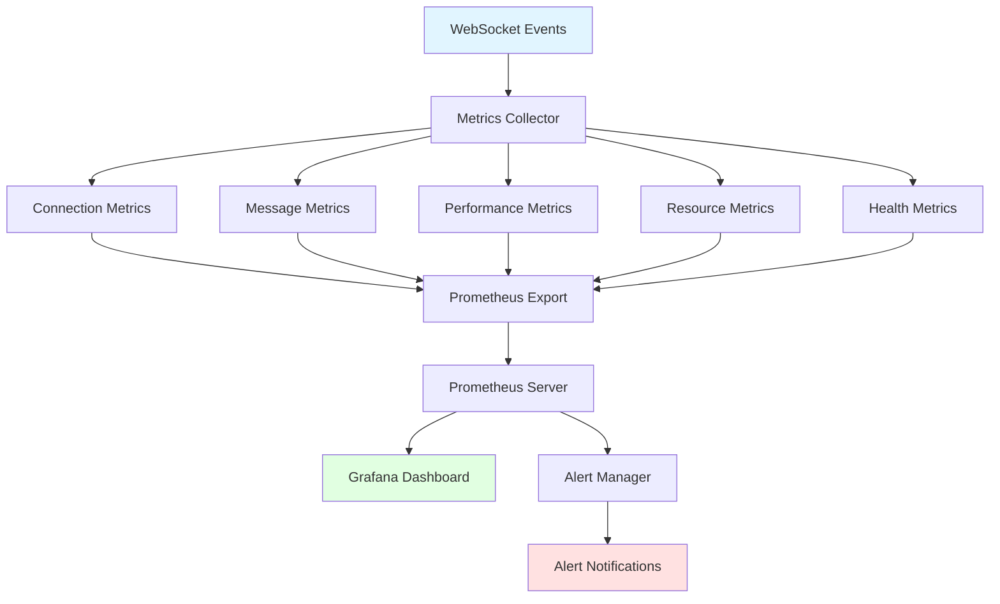

# WebSocket Performance Monitoring and Metrics Collection

## Overview

This document describes the comprehensive WebSocket monitoring system implemented for VitalStream, providing real-time insights into connection health, message throughput, latency, and resource usage with Prometheus integration and Grafana visualization.

## Architecture

### Monitoring Flow



### Components

1. **WebSocketMetricsCollector**: Core metrics collection engine
2. **Prometheus Integration**: Metrics export and labeling
3. **Grafana Dashboard**: Real-time visualization
4. **Alerting System**: Proactive monitoring and notifications
5. **Resource Monitoring**: CPU, memory, and network tracking

## Metrics Categories

### Connection Metrics

| Metric | Type | Labels | Description |
|--------|------|--------|-------------|
| `websocket_connections_active` | Gauge | role, user_id, patient_id | Current active connections |
| `websocket_connections_total` | Counter | role, status | Total connections created |
| `websocket_disconnections_total` | Counter | role, reason, status | Total disconnections |
| `websocket_connection_duration_seconds` | Histogram | role, termination_reason | Connection duration distribution |
| `websocket_reconnection_attempts_total` | Counter | role, attempt_number | Reconnection attempts |

### Message Metrics

| Metric | Type | Labels | Description |
|--------|------|--------|-------------|
| `websocket_messages_sent_total` | Counter | message_type, priority, role, target_type | Messages sent |
| `websocket_messages_received_total` | Counter | message_type, source_type, role | Messages received |
| `websocket_message_size_bytes` | Histogram | message_type, direction, compression | Message size distribution |
| `websocket_message_latency_seconds` | Histogram | message_type, processing_stage | Message processing latency |
| `websocket_broadcast_latency_seconds` | Histogram | target_type, broadcast_type, recipient_count | Broadcast latency |
| `websocket_failed_messages_total` | Counter | message_type, failure_reason, role | Failed messages |

### Performance Metrics

| Metric | Type | Labels | Description |
|--------|------|--------|-------------|
| `websocket_throughput_messages_per_second` | Gauge | direction, message_type, role | Message throughput |
| `websocket_bandwidth_bytes_per_second` | Gauge | direction, protocol, role | Bandwidth usage |
| `websocket_compression_ratio_percent` | Histogram | compression_type, message_type | Compression effectiveness |
| `websocket_backpressure_events_total` | Counter | backpressure_type, severity, role | Backpressure events |
| `websocket_buffer_utilization_percent` | Gauge | buffer_type, role | Buffer utilization |
| `websocket_queue_size` | Gauge | queue_type, role | Message queue size |

### Resource Metrics

| Metric | Type | Labels | Description |
|--------|------|--------|-------------|
| `websocket_cpu_usage_percent` | Gauge | process_type, role | CPU usage |
| `websocket_memory_usage_bytes` | Gauge | memory_type, role | Memory usage |
| `websocket_file_descriptors_count` | Gauge | type | File descriptor count |
| `websocket_thread_pool_utilization_percent` | Gauge | pool_type, role | Thread pool utilization |

### Health Metrics

| Metric | Type | Labels | Description |
|--------|------|--------|-------------|
| `websocket_health_score` | Gauge | connection_id, role | Connection health score |
| `websocket_heartbeat_success_rate_percent` | Gauge | role | Heartbeat success rate |
| `websocket_stale_connections_total` | Counter | stale_type, role | Stale connections |

### Subscription Metrics

| Metric | Type | Labels | Description |
|--------|------|--------|-------------|
| `websocket_subscriptions_active` | Gauge | subscription_type, role | Active subscriptions |
| `websocket_subscription_matches_total` | Counter | subscription_type, match_type, role | Subscription matches |
| `websocket_subscription_failures_total` | Counter | failure_type, role | Subscription failures |

## Implementation Details

### Metrics Collector

The `WebSocketMetricsCollector` class provides comprehensive metrics collection:

```python
from app.websocket.metrics import WebSocketMetricsCollector

# Initialize metrics collector
metrics = WebSocketMetricsCollector(enable_resource_monitoring=True)

# Start background monitoring
await metrics.start_monitoring()

# Record connection
metrics.record_connection("conn_123", "doctor", "user_456", 789)

# Record message
metrics.record_message_sent("conn_123", "ecg_data", "high", 1024, 0.05)

# Stop monitoring
await metrics.stop_monitoring()
```

### Integration with Connection Manager

The metrics collector integrates seamlessly with the `EnhancedConnectionManager`:

```python
from app.websocket.metrics import websocket_metrics_collector
from app.websocket.connection_manager import EnhancedConnectionManager

# Create connection manager with metrics
manager = EnhancedConnectionManager()

# Connect with metrics tracking
connection_id = await manager.connect(
    websocket, user_id, role, patient_id,
    backpressure_enabled=True,
    binary_protocol_enabled=True
)

# Metrics are automatically recorded
```

### Prometheus Export

Metrics are exported through the `/metrics` endpoint:

```python
from app.websocket.metrics import get_websocket_metrics

# Export metrics for Prometheus
metrics_data = get_websocket_metrics()
```

## Grafana Dashboard

### Dashboard Features

The Grafana dashboard provides real-time visualization of:

1. **Active Connections**: Real-time connection count by role
2. **Message Throughput**: Messages per second (sent/received)
3. **Latency Percentiles**: P50, P95, P99 latencies
4. **Bandwidth Usage**: Network bandwidth consumption
5. **Compression Ratio**: Compression effectiveness
6. **Buffer Utilization**: Buffer usage percentages
7. **Resource Usage**: CPU and memory consumption
8. **Active Subscriptions**: Subscription counts by type
9. **Heartbeat Success Rate**: Connection health indicators
10. **Error Rates**: Failure and disconnection rates

### Dashboard Installation

1. Import the dashboard JSON file into Grafana
2. Configure Prometheus data source
3. Set up alerting rules
4. Configure notification channels

## Alerting Rules

### Alert Categories

#### Performance Alerts
- **High Latency**: P95 latency > 500ms
- **High CPU Usage**: CPU > 80%
- **High Memory Usage**: Memory > 1GB
- **Low Compression Ratio**: Compression < 50%

#### Connection Alerts
- **Connection Drops**: Disconnection rate > 10/sec
- **No Connections**: Zero active connections
- **Low Health Score**: Health score < 70%

#### System Alerts
- **Backpressure**: Buffer utilization > 80%
- **High Failure Rate**: Message failure rate > 5%

### Alert Configuration

Alerts are configured in `prometheus-websocket-alerts.yml`:

```yaml
groups:
  - name: websocket_alerts
    rules:
      - alert: HighWebSocketLatency
        expr: histogram_quantile(0.95, rate(websocket_message_latency_seconds_bucket[5m])) > 0.5
        for: 5m
        labels:
          severity: warning
          service: websocket
        annotations:
          summary: "High WebSocket message latency detected"
          description: "95th percentile latency is {{ $value }}s"
```

## Performance Considerations

### Metrics Collection Overhead

| Metric | Target Overhead | Critical Threshold |
|--------|-----------------|-------------------|
| CPU Usage | <1% | <5% |
| Memory Usage | <50MB | <100MB |
| Export Latency | <100ms | <500ms |
| Collection Frequency | 1-5 seconds | 10+ seconds |

### Optimization Strategies

1. **Batch Processing**: Collect metrics in batches
2. **Sampling**: Use statistical sampling for high-frequency metrics
3. **Background Processing**: Use async tasks for non-blocking collection
4. **Memory Management**: Limit history retention
5. **Selective Monitoring**: Enable/disable specific metric categories

## Configuration

### Environment Variables

```bash
# Enable/disable monitoring
WEBSOCKET_MONITORING_ENABLED=true

# Resource monitoring
WEBSOCKET_RESOURCE_MONITORING=true

# Metrics collection interval
WEBSOCKET_METRICS_INTERVAL=5

# Alert thresholds
WEBSOCKET_LATENCY_THRESHOLD=0.5
WEBSOCKET_CPU_THRESHOLD=80
WEBSOCKET_MEMORY_THRESHOLD=1073741824
```

### Configuration Options

```python
from app.websocket.metrics import WebSocketMetricsCollector

# Configure thresholds
metrics = WebSocketMetricsCollector(
    enable_resource_monitoring=True
)

# Set alert thresholds
metrics.alert_thresholds = {
    'max_latency': 1.0,
    'max_cpu_usage': 80.0,
    'max_memory_usage': 1024 * 1024 * 1024,
    'max_failed_rate': 0.05,
    'min_health_score': 70.0
}
```

## Troubleshooting

### Common Issues

#### High Metrics Overhead
- **Symptoms**: Increased CPU/memory usage
- **Causes**: Too frequent collection, large history retention
- **Solutions**: Increase collection interval, reduce history size

#### Missing Metrics
- **Symptoms**: No data in Grafana
- **Causes**: Metrics not exported, incorrect labels
- **Solutions**: Check `/metrics` endpoint, verify integration

#### False Alerts
- **Symptoms**: Alert notifications without issues
- **Causes**: Incorrect thresholds, timing issues
- **Solutions**: Adjust thresholds, increase alert duration

### Debugging Tools

#### Metrics Inspection
```python
# Get metrics summary
summary = websocket_metrics_collector.get_metrics_summary()
print(f"Active connections: {summary['connections']['total']}")
print(f"Messages sent: {summary['messages']['sent_total']}")

# Get connection metrics
conn_metrics = websocket_metrics_collector.get_connection_metrics("conn_123")
print(f"Connection health: {conn_metrics}")
```

#### Performance Analysis
```python
# Get latency percentiles
percentiles = websocket_metrics_collector.get_latency_percentiles("ecg_data")
print(f"P95 latency: {percentiles['p95']}s")

# Get performance snapshots
snapshots = websocket_metrics_collector.get_performance_snapshots(10)
for snapshot in snapshots:
    print(f"CPU: {snapshot.cpu_usage}%, Memory: {snapshot.memory_usage}MB")
```

## Best Practices

### Metrics Design
1. **Use Appropriate Types**: Counters for cumulative values, Gauges for current values, Histograms for distributions
2. **Meaningful Labels**: Use descriptive labels for filtering and aggregation
3. **Consistent Naming**: Follow Prometheus naming conventions
4. **Proper Buckets**: Configure histogram buckets for your use case

### Performance Optimization
1. **Batch Operations**: Collect multiple metrics together
2. **Async Processing**: Use non-blocking operations
3. **Memory Management**: Limit data retention
4. **Selective Monitoring**: Enable only needed metrics

### Alerting Strategy
1. **Meaningful Thresholds**: Set thresholds based on SLA requirements
2. **Appropriate Duration**: Use sufficient evaluation periods
3. **Clear Documentation**: Provide runbooks for each alert
4. **Escalation Paths**: Configure proper notification channels

## Future Enhancements

### Planned Features
1. **Distributed Tracing**: Integration with OpenTelemetry
2. **Advanced Analytics**: Machine learning for anomaly detection
3. **Custom Dashboards**: Role-specific dashboard templates
4. **API Integration**: REST API for metrics access
5. **Historical Analysis**: Long-term trend analysis

### Scaling Considerations
1. **Horizontal Scaling**: Support for multiple WebSocket servers
2. **Metrics Aggregation**: Cross-server metric aggregation
3. **Load Balancing**: Metrics-aware load balancing
4. **Caching**: Redis-based metrics caching

## Conclusion

The WebSocket monitoring system provides comprehensive visibility into the health and performance of the WebSocket infrastructure. With real-time metrics collection, proactive alerting, and detailed visualization, operators can ensure optimal performance and quickly identify and resolve issues.

The system is designed to be lightweight, extensible, and production-ready, with minimal overhead and maximum insight into WebSocket operations.
