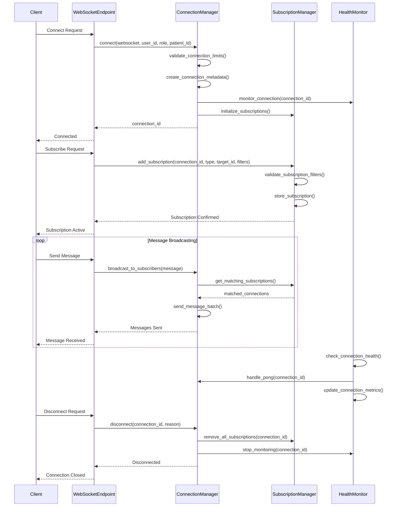
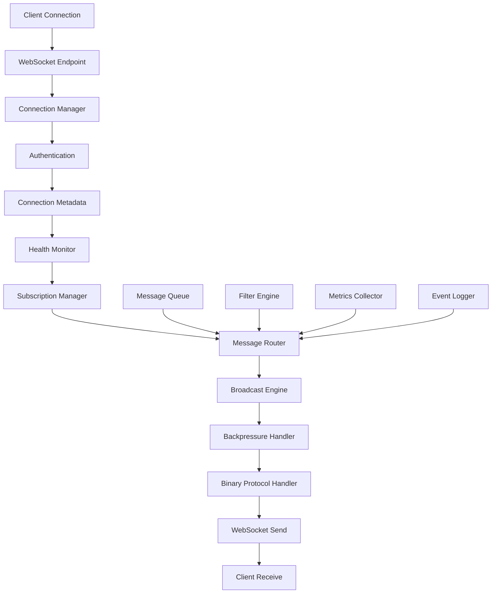
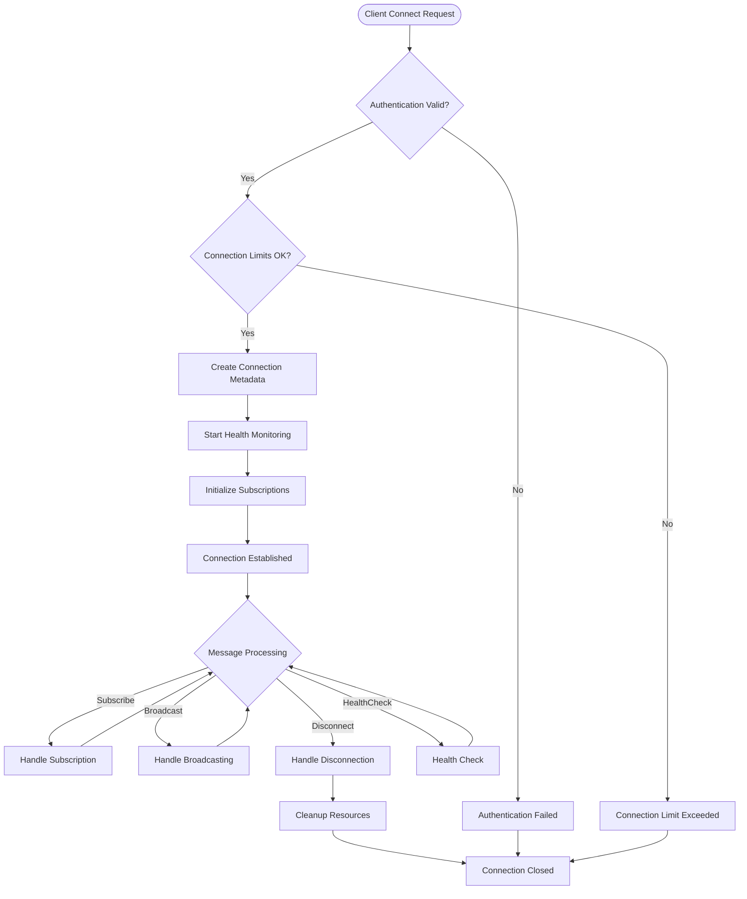

# WebSocket Multi-Client Management System

## Overview

This document describes the enhanced WebSocket multi-client connection management system designed to support 1000+ concurrent connections with enterprise-grade features including connection pooling, subscription management, health monitoring, and efficient broadcasting.

## Architecture

### System Components

```
┌─────────────────────────────────────────────────────────────┐
│                    WebSocket System                         │
├─────────────────────────────────────────────────────────────┤
│  ┌─────────────────┐  ┌─────────────────┐  ┌──────────────┐ │
│  │ Connection      │  │ Subscription    │  │ WebSocket     │ │
│  │ Manager         │  │ Manager         │  │ Endpoint      │ │
│  │                 │  │                 │  │              │ │
│  │ • Connection    │  │ • Subscriptions │  │ • Message     │ │
│  │   Pooling       │  │ • Filtering     │  │   Handling    │ │
│  │ • Health        │  │ • Analytics     │  │ • Routing     │ │
│  │   Monitoring    │  │ • Events        │  │ • Auth        │ │
│  └─────────────────┘  └─────────────────┘  └──────────────┘ │
├─────────────────────────────────────────────────────────────┤
│  ┌─────────────────┐  ┌─────────────────┐  ┌──────────────┐ │
│  │ Backpressure    │  │ Binary          │  │ Reconnect    │ │
│  │ Handler         │  │ Protocol        │  │ Service      │ │
│  │                 │  │ Handler         │  │              │ │
│  │ • Flow Control  │  │ • Binary Data   │  │ • Auto        │ │
│  │ • Rate Limiting │  │ • Compression   │  │   Reconnect  │ │
│  │ • Buffer Mgmt   │  │ • Encoding      │  │ • Session     │ │
│  └─────────────────┘  └─────────────────┘  │   Restore    │ │
│                                         └──────────────┘ │
└─────────────────────────────────────────────────────────────┘
```

### Connection Lifecycle Sequence Diagram



### Data Flow Architecture



### Key Features

- **Connection Pooling**: Support for 10,000 concurrent connections with per-user and per-role limits
- **Subscription Management**: Advanced filtering with patient-based, type-based, and wildcard subscriptions
- **Health Monitoring**: Automatic heartbeat/pong monitoring with stale connection cleanup
- **Efficient Broadcasting**: Parallel message delivery with batching and selective filtering
- **Automatic Reconnection**: Exponential backoff reconnection with session restoration
- **Metrics & Analytics**: Comprehensive connection and subscription metrics
- **Backpressure Handling**: Flow control and rate limiting for optimal performance

## Configuration

### Connection Manager Settings

```python
MAX_CONNECTIONS = 10000                    # Global connection limit
MAX_CONNECTIONS_PER_USER = 10             # Per-user connection limit
MAX_CONNECTIONS_PER_ROLE = 100            # Per-role connection limit
HEARTBEAT_INTERVAL = 30                   # Heartbeat interval (seconds)
CONNECTION_TIMEOUT = 90                    # Connection timeout (seconds)
BROADCAST_BATCH_SIZE = 100                # Broadcast batch size
BROADCAST_TIMEOUT = 5.0                   # Broadcast timeout (seconds)
MAX_MESSAGE_SIZE = 1024 * 1024           # Max message size (1MB)
CLEANUP_INTERVAL = 60                     # Cleanup interval (seconds)
```

### Subscription Manager Settings

```python
MAX_SUBSCRIPTIONS_PER_CONNECTION = 100    # Max subscriptions per connection
MAX_SUBSCRIPTIONS_GLOBAL = 50000          # Global subscription limit
SUBSCRIPTION_TIMEOUT = 3600               # Subscription timeout (1 hour)
EVENT_HISTORY_SIZE = 10000                # Event history size
CLEANUP_INTERVAL = 300                   # Cleanup interval (5 minutes)
```

### Reconnection Service Settings

```typescript
interface ReconnectionConfig {
  maxAttempts: 10;                        // Max reconnection attempts
  initialDelay: 1000;                     // Initial delay (ms)
  maxDelay: 30000;                        // Maximum delay (ms)
  backoffMultiplier: 2.0;                 // Backoff multiplier
  jitterFactor: 0.1;                      // Jitter factor
  heartbeatInterval: 30000;               // Heartbeat interval (ms)
  connectionTimeout: 10000;               // Connection timeout (ms)
  enableSessionRestore: true;             // Enable session restore
  enableMessageReplay: true;              // Enable message replay
}
```

## API Reference

### WebSocket Connection

#### Connect to WebSocket

```typescript
// Frontend connection with reconnection
const reconnectService = new WebSocketReconnectService({
  maxAttempts: 10,
  initialDelay: 1000,
  maxDelay: 30000,
  enableSessionRestore: true
});

const ws = await reconnectService.connect('ws://localhost:8000/ws/connect', {
  userId: 'user123',
  role: 'doctor',
  subscriptions: ['patient:123', 'type:ecg'],
  autoReconnect: true
});
```

#### Subscribe to Data

```json
{
  "type": "subscribe",
  "subscription_type": "patient",
  "target_id": "123",
  "filters": {
    "severity": "high",
    "data_type": "ecg"
  }
}
```

#### Unsubscribe from Data

```json
{
  "type": "unsubscribe",
  "subscription_type": "patient",
  "target_id": "123"
}
```

### REST API Endpoints

#### Get WebSocket Metrics

```http
GET /ws/metrics
```

Response:
```json
{
  "status": "success",
  "data": {
    "connections": {
      "total": 1500,
      "active": 1450,
      "disconnected": 50,
      "errors": 5
    },
    "messages": {
      "sent": 150000,
      "received": 120000,
      "bytes_sent": 50000000,
      "bytes_received": 40000000
    },
    "subscriptions": {
      "total": 3000,
      "active": 2800,
      "expired": 200,
      "operations": 5000
    },
    "performance": {
      "broadcast_operations": 10000,
      "filter_operations": 25000,
      "memory_usage_mb": 850.5
    }
  }
}
```

#### Broadcast to Patient

```http
POST /ws/broadcast/patient/{patient_id}
```

Body:
```json
{
  "type": "ecg_data",
  "patient_id": 123,
  "data": [1.2, 1.5, 1.8, 2.1],
  "timestamp": "2024-01-15T10:30:00Z",
  "severity": "normal"
}
```

#### Broadcast to Type

```http
POST /ws/broadcast/type/{subscription_type}
```

Body:
```json
{
  "type": "system_alert",
  "message": "ECG sensor maintenance scheduled",
  "severity": "info",
  "timestamp": "2024-01-15T10:30:00Z"
}
```

## Usage Examples

### Backend: Broadcasting ECG Data

```python
from app.websocket.connection_manager import connection_manager

async def broadcast_ecg_data(patient_id: int, ecg_data: List[float]):
    """Broadcast ECG data to all subscribers of a patient."""
    message = {
        "type": "ecg_data",
        "patient_id": patient_id,
        "data": ecg_data,
        "timestamp": datetime.utcnow().isoformat(),
        "sampling_rate": 250  # Hz
    }
    
    # Broadcast to all patient subscribers
    delivered = await connection_manager.broadcast_to_patient(
        patient_id, message
    )
    
    logger.info(f"ECG data broadcast to {delivered} subscribers")
```

### Backend: System Alert Broadcasting

```python
from app.websocket.connection_manager import connection_manager

async def broadcast_system_alert(message: str, severity: str = "info"):
    """Broadcast system alert to all connections."""
    alert_message = {
        "type": "system_alert",
        "message": message,
        "severity": severity,
        "timestamp": datetime.utcnow().isoformat()
    }
    
    # Broadcast to all connections
    delivered = await connection_manager.broadcast_to_all(alert_message)
    
    logger.info(f"System alert broadcast to {delivered} connections")
```

### Frontend: WebSocket Service Integration

```typescript
import { WebSocketReconnectService } from './websocket-reconnect.service';

class ECGMonitorService {
  private reconnectService: WebSocketReconnectService;
  
  constructor() {
    this.reconnectService = new WebSocketReconnectService({
      maxAttempts: 10,
      initialDelay: 1000,
      maxDelay: 30000,
      enableSessionRestore: true
    });
    
    this.setupEventListeners();
  }
  
  async connect(userId: string, role: string, patientId?: number) {
    try {
      const ws = await this.reconnectService.connect(
        'ws://localhost:8000/ws/connect',
        {
          userId,
          role,
          patientId,
          subscriptions: patientId 
            ? [`patient:${patientId}`, 'type:ecg', 'type:alerts']
            : ['type:system', 'type:alerts']
        }
      );
      
      // Subscribe to specific data types
      if (patientId) {
        await this.subscribeToPatient(patientId);
      }
      
      return ws;
    } catch (error) {
      console.error('Failed to connect:', error);
      throw error;
    }
  }
  
  private async subscribeToPatient(patientId: number) {
    const subscriptionMessage = {
      type: 'subscribe',
      subscription_type: 'patient',
      target_id: patientId.toString(),
      filters: {
        data_type: 'ecg',
        severity: ['normal', 'warning', 'critical']
      }
    };
    
    // Queue message for sending
    this.reconnectService.queueMessage(subscriptionMessage);
  }
  
  private setupEventListeners() {
    this.reconnectService.on('connected', (data) => {
      console.log('WebSocket connected:', data);
    });
    
    this.reconnectService.on('disconnected', (data) => {
      console.log('WebSocket disconnected:', data);
    });
    
    this.reconnectService.on('reconnected', (data) => {
      console.log('WebSocket reconnected:', data);
    });
    
    this.reconnectService.on('message', (data) => {
      this.handleIncomingMessage(data.data);
    });
  }
  
  private handleIncomingMessage(message: any) {
    switch (message.type) {
      case 'ecg_data':
        this.displayECGData(message);
        break;
      case 'system_alert':
        this.displayAlert(message);
        break;
      case 'pong':
        // Handle heartbeat response
        break;
      default:
        console.log('Unknown message type:', message.type);
    }
  }
  
  private displayECGData(data: any) {
    // Update ECG visualization
    const ecgChart = document.getElementById('ecg-chart');
    // ... update chart with data.data array
  }
  
  private displayAlert(alert: any) {
    // Display system alert
    const alertContainer = document.getElementById('alerts');
    const alertElement = document.createElement('div');
    alertElement.className = `alert alert-${alert.severity}`;
    alertElement.textContent = alert.message;
    alertContainer.appendChild(alertElement);
  }
  
  getMetrics() {
    return this.reconnectService.getMetrics();
  }
  
  disconnect() {
    this.reconnectService.disconnect();
  }
}
```

## Performance Optimization

### Connection Management

1. **Connection Pooling**: Reuse connections when possible
2. **Batch Processing**: Process messages in batches to reduce overhead
3. **Selective Broadcasting**: Use filters to send messages only to relevant connections
4. **Connection Limits**: Enforce limits to prevent resource exhaustion

### Memory Management

1. **Message Queues**: Limit queue sizes to prevent memory bloat
2. **Subscription Cleanup**: Regularly clean up expired subscriptions
3. **Connection Cleanup**: Remove stale connections automatically
4. **Metrics Collection**: Collect metrics efficiently without impacting performance

### Broadcasting Optimization

1. **Parallel Sending**: Use `asyncio.gather()` for concurrent message sending
2. **Batch Size**: Optimize batch size based on network conditions
3. **Timeout Handling**: Set appropriate timeouts to prevent hanging
4. **Error Isolation**: Handle individual connection failures without affecting others

## Monitoring and Debugging

### Metrics to Monitor

- **Connection Metrics**: Total connections, active connections, connection errors
- **Message Metrics**: Messages sent/received, bytes transferred, broadcast operations
- **Subscription Metrics**: Total subscriptions, active/expired subscriptions, filter operations
- **Performance Metrics**: Memory usage, broadcast latency, cleanup operations

### Debugging Tools

1. **Connection Info**: Get detailed information about specific connections
2. **Subscription Analytics**: View subscription patterns and filter effectiveness
3. **Event History**: Track subscription events and connection lifecycle
4. **Performance Profiling**: Monitor memory usage and operation timing

### Logging

Enable debug logging to trace connection and subscription operations:

```python
import logging
logging.getLogger('app.websocket').setLevel(logging.DEBUG)
```

## Security Considerations

### Authentication and Authorization

- WebSocket connections require valid authentication tokens
- User roles determine subscription permissions
- Patient access is restricted based on user permissions

### Data Validation

- All incoming messages are validated for structure and content
- Subscription filters are sanitized to prevent injection attacks
- Message size limits prevent resource exhaustion

### Rate Limiting

- Connection limits prevent abuse
- Message rate limiting prevents spam
- Backpressure handling manages high-volume scenarios

## Best Practices

### Backend Development

1. Use connection limits to prevent resource exhaustion
2. Implement proper error handling and logging
3. Monitor metrics for performance optimization
4. Use selective broadcasting to reduce network traffic

### Frontend Development

1. Implement automatic reconnection with exponential backoff
2. Handle connection state changes gracefully
3. Use message queuing for reliable delivery
4. Monitor connection health and user experience

### Operations

1. Set up monitoring for key metrics
2. Configure alerts for connection issues
3. Regularly review subscription patterns
4. Plan for capacity scaling

## Connection Lifecycle Flowchart



## Troubleshooting Common Issues

### Connection Problems

#### Issue: WebSocket Connection Fails
**Symptoms**: Clients cannot establish WebSocket connections
**Causes**: 
- Authentication token invalid or expired
- Connection limits exceeded
- WebSocket server not running
- Network connectivity issues

**Solutions**:
```python
# Check authentication
if not verify_token(token):
    return {"error": "Invalid authentication token"}

# Check connection limits
if len(connection_manager.connections) >= MAX_CONNECTIONS:
    return {"error": "Connection limit exceeded"}

# Check server status
if not websocket_server.is_running():
    return {"error": "WebSocket server not available"}
```

#### Issue: High Memory Usage
**Symptoms**: Memory usage increases continuously over time
**Causes**:
- Connection metadata not cleaned up
- Message queue growing indefinitely
- Subscription memory leaks
- Health monitor not removing stale connections

**Solutions**:
```python
# Enable automatic cleanup
CLEANUP_INTERVAL = 60  # seconds
MAX_MESSAGE_QUEUE_SIZE = 1000
SUBSCRIPTION_TIMEOUT = 3600  # 1 hour

# Monitor memory usage
def monitor_memory_usage():
    import psutil
    memory_usage = psutil.virtual_memory().percent
    if memory_usage > 80:
        logger.warning(f"High memory usage: {memory_usage}%")
        trigger_emergency_cleanup()
```

#### Issue: Slow Message Delivery
**Symptoms**: Messages take too long to reach clients
**Causes**:
- Backpressure active
- Large message sizes
- Network latency
- Broadcast batching issues

**Solutions**:
```python
# Optimize message size
MAX_MESSAGE_SIZE = 1024 * 1024  # 1MB

# Enable compression for large messages
if message_size > 100 * 1024:  # 100KB
    message = compress_message(message)

# Adjust batch size for better performance
BROADCAST_BATCH_SIZE = 50  # Reduce from 100
```

### Subscription Issues

#### Issue: Messages Not Delivered to Subscribed Clients
**Symptoms**: Clients subscribed to topics don't receive messages
**Causes**:
- Filter expressions incorrect
- Subscription not properly registered
- Wildcard subscription conflicts
- Connection state issues

**Solutions**:
```python
# Debug subscription matching
def debug_subscription_matching(connection_id, message_type, target_id, message_data):
    subscriptions = subscription_manager.get_connection_subscriptions(connection_id)
    for sub in subscriptions:
        if subscription_manager.matches_filter(message_data, sub.filters):
            logger.info(f"Message matches subscription {sub.subscription_id}")
        else:
            logger.warning(f"Message does not match subscription {sub.subscription_id}")

# Check subscription registration
def check_subscription_health():
    all_subscriptions = subscription_manager.get_all_subscriptions()
    active_connections = len(connection_manager.connections)
    
    logger.info(f"Total subscriptions: {len(all_subscriptions)}")
    logger.info(f"Active connections: {active_connections}")
    
    # Check for orphaned subscriptions
    orphaned = 0
    for sub in all_subscriptions:
        if sub.connection_id not in connection_manager.connections:
            orphaned += 1
    
    if orphaned > 0:
        logger.warning(f"Found {orphaned} orphaned subscriptions")
        subscription_manager.cleanup_orphaned_subscriptions()
```

### Health Monitoring Issues

#### Issue: False Connection Timeouts
**Symptoms**: Healthy connections marked as stale and disconnected
**Causes**:
- Heartbeat interval too short
- Network latency causing delayed responses
- Client processing delays
- Server load issues

**Solutions**:
```python
# Adjust heartbeat settings
HEARTBEAT_INTERVAL = 30  # Increase from 15 seconds
CONNECTION_TIMEOUT = 90  # Increase from 60 seconds

# Add jitter to prevent thundering herd
def calculate_heartbeat_interval(base_interval):
    import random
    jitter = random.uniform(0.8, 1.2)  # ±20% jitter
    return base_interval * jitter

# Implement adaptive timeout
def get_adaptive_timeout(connection):
    base_timeout = CONNECTION_TIMEOUT
    latency_history = connection.latency_history
    
    if latency_history:
        avg_latency = sum(latency_history) / len(latency_history)
        if avg_latency > 1000:  # 1 second
            base_timeout *= 2
    
    return base_timeout
```

### Performance Issues

#### Issue: High CPU Usage During Broadcasting
**Symptoms**: CPU usage spikes when broadcasting messages
**Causes**:
- Inefficient message serialization
- Too many small broadcasts instead of batching
- Complex filter operations
- Synchronous processing

**Solutions**:
```python
# Implement efficient broadcasting
async def optimized_broadcast(message, target_connections):
    # Batch connections
    batch_size = 50
    batches = [target_connections[i:i+batch_size] 
                for i in range(0, len(target_connections), batch_size)]
    
    # Serialize once per batch
    serialized_message = json.dumps(message)
    
    # Process batches concurrently
    tasks = []
    for batch in batches:
        task = send_to_batch(batch, serialized_message)
        tasks.append(task)
    
    await asyncio.gather(*tasks, return_exceptions=True)

# Optimize filter operations
def optimize_filter_engine():
    # Use compiled regex for complex filters
    compiled_filters = {}
    
    for filter_expr in filter_expressions:
        if isinstance(filter_expr, dict) and '$regex' in filter_expr:
            compiled_filters[filter_expr['$regex']] = re.compile(filter_expr['$regex'])
    
    return compiled_filters
```

### Debugging Tools and Techniques

#### Connection State Inspector
```python
def inspect_connection_state():
    """Comprehensive connection state inspection."""
    
    print("=== Connection State Inspection ===")
    print(f"Total connections: {len(connection_manager.connections)}")
    print(f"Total subscriptions: {len(subscription_manager.get_all_subscriptions())}")
    
    # Connection by role
    role_counts = {}
    for conn_id, metadata in connection_manager.connections.items():
        role = metadata.role
        role_counts[role] = role_counts.get(role, 0) + 1
    
    print("Connections by role:")
    for role, count in role_counts.items():
        print(f"  {role}: {count}")
    
    # Subscription statistics
    sub_stats = subscription_manager.get_metrics()
    print(f"Subscription metrics: {sub_stats}")
    
    # Health monitor status
    health_metrics = health_monitor.get_health_metrics()
    print(f"Health metrics: {health_metrics}")
```

#### Message Flow Tracer
```python
def trace_message_flow(message_id, message_data):
    """Trace message flow through the system."""
    
    print(f"=== Message Flow Trace [{message_id}] ===")
    print(f"Message type: {message_data.get('type')}")
    print(f"Message size: {len(json.dumps(message_data))} bytes")
    
    # Find matching subscriptions
    matching_subs = subscription_manager.get_matching_subscriptions(
        message_data.get('type'),
        message_data.get('target_id'),
        message_data
    )
    
    print(f"Matching subscriptions: {len(matching_subs)}")
    
    # Check delivery status
    delivered_count = 0
    failed_count = 0
    
    for sub in matching_subs:
        try:
            # Attempt delivery
            connection_manager.send_message(sub.connection_id, message_data)
            delivered_count += 1
        except Exception as e:
            failed_count += 1
            print(f"Failed to deliver to {sub.connection_id}: {e}")
    
    print(f"Delivered: {delivered_count}, Failed: {failed_count}")
```

#### Performance Profiler
```python
import cProfile
import pstats

def profile_websocket_operations():
    """Profile WebSocket operations for performance analysis."""
    
    profiler = cProfile.Profile()
    
    # Profile connection operations
    profiler.enable()
    
    # Simulate typical operations
    for i in range(100):
        # Simulate connection
        connection_manager.connect(mock_websocket, f"user_{i}", "doctor", i)
        
        # Simulate subscription
        connection_manager.subscribe(f"conn_{i}", "patient", str(i))
        
        # Simulate broadcast
        connection_manager.broadcast_to_type("patient", {"test": "data"})
    
    profiler.disable()
    
    # Generate report
    stats = pstats.Stats(profiler)
    stats.sort_stats('cumulative')
    
    print("=== WebSocket Performance Profile ===")
    stats.print_stats(10)  # Top 10 functions
```

### Common Error Codes and Solutions

| Error Code | Description | Solution |
|------------|-------------|----------|
| 1001 | Authentication failed | Check token validity and expiration |
| 1002 | Connection limit exceeded | Increase limits or implement connection pooling |
| 1003 | Invalid subscription format | Validate subscription parameters |
| 1004 | Message too large | Implement message compression or chunking |
| 1005 | Backpressure active | Implement client-side flow control |
| 1006 | Health check failed | Check network connectivity and server load |
| 1007 | Subscription timeout | Refresh subscriptions or check connection state |
| 1008 | Filter parsing error | Validate filter syntax and operators |
| 1009 | Binary protocol error | Check message encoding and format |
| 1010 | Rate limit exceeded | Implement rate limiting on client side |

### Monitoring and Alerting

#### Key Metrics to Monitor
```python
# Essential metrics for monitoring
MONITORING_METRICS = {
    'connections': {
        'total': 'Total number of active connections',
        'by_role': 'Connections broken down by user role',
        'by_patient': 'Connections broken down by patient',
        'new_per_minute': 'New connection rate',
        'disconnected_per_minute': 'Disconnection rate'
    },
    'subscriptions': {
        'total': 'Total number of active subscriptions',
        'by_type': 'Subscriptions broken down by type',
        'wildcard_count': 'Number of wildcard subscriptions',
        'filter_complexity': 'Average filter complexity score'
    },
    'performance': {
        'message_rate': 'Messages per second',
        'broadcast_latency': 'Average broadcast latency',
        'queue_size': 'Message queue size',
        'error_rate': 'Error rate percentage',
        'memory_usage': 'Memory usage percentage'
    },
    'health': {
        'healthy_connections': 'Number of healthy connections',
        'unhealthy_connections': 'Number of unhealthy connections',
        'avg_latency': 'Average connection latency',
        'heartbeat_success_rate': 'Heartbeat success rate'
    }
}
```

#### Alert Thresholds
```python
ALERT_THRESHOLDS = {
    'connection_count': {
        'warning': 8000,  # 80% of max 10,000
        'critical': 9500   # 95% of max 10,000
    },
    'error_rate': {
        'warning': 5.0,    # 5% error rate
        'critical': 10.0   # 10% error rate
    },
    'latency': {
        'warning': 200,    # 200ms average latency
        'critical': 500    # 500ms average latency
    },
    'memory_usage': {
        'warning': 75.0,   # 75% memory usage
        'critical': 90.0   # 90% memory usage
    }
}
```

### Emergency Procedures

#### System Overload Response
```python
async def handle_system_overload():
    """Emergency response to system overload."""
    
    logger.critical("System overload detected - initiating emergency procedures")
    
    # 1. Stop accepting new connections
    connection_manager.set_accept_connections(False)
    
    # 2. Increase cleanup frequency
    connection_manager.set_cleanup_interval(30)  # 30 seconds
    
    # 3. Reduce broadcast batch size
    connection_manager.set_broadcast_batch_size(25)
    
    # 4. Enable aggressive cleanup
    await subscription_manager.aggressive_cleanup()
    
    # 5. Notify monitoring system
    await send_alert("SYSTEM_OVERLOAD", {
        "connections": len(connection_manager.connections),
        "subscriptions": len(subscription_manager.get_all_subscriptions()),
        "memory_usage": psutil.virtual_memory().percent
    })
```

#### Graceful Shutdown
```python
async def graceful_shutdown():
    """Graceful shutdown of WebSocket system."""
    
    logger.info("Initiating graceful shutdown")
    
    # 1. Stop accepting new connections
    connection_manager.set_accept_connections(False)
    
    # 2. Notify all clients of impending shutdown
    shutdown_message = {
        "type": "system_shutdown",
        "message": "Server shutting down in 30 seconds",
        "timestamp": datetime.utcnow().isoformat()
    }
    
    await connection_manager.broadcast_to_all(shutdown_message)
    
    # 3. Wait for clients to disconnect
    await asyncio.sleep(30)
    
    # 4. Force disconnect remaining connections
    for connection_id in list(connection_manager.connections.keys()):
        await connection_manager.disconnect(connection_id, "server_shutdown")
    
    # 5. Cleanup resources
    await subscription_manager.shutdown()
    await health_monitor.shutdown()
    
    logger.info("Graceful shutdown completed")
```

## Future Enhancements

### Planned Features

1. **Load Balancing**: Distribute connections across multiple instances
2. **Message Persistence**: Store messages for offline clients
3. **Advanced Filtering**: Support for complex filter expressions
4. **Performance Analytics**: Detailed performance profiling tools

### Scaling Considerations

1. **Horizontal Scaling**: Support for multiple WebSocket servers
2. **Database Integration**: Persistent subscription storage
3. **Caching Layer**: Redis for subscription and connection state
4. **Microservices**: Separate services for connection and subscription management

---

This documentation provides a comprehensive guide to the WebSocket multi-client management system. For specific implementation details, refer to the source code and API documentation.
