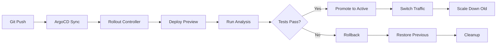

# VitalStream Blue-Green Deployment Guide

Production-ready blue-green deployment strategy with Argo Rollouts, automated smoke tests, SLO-based rollback, and zero-downtime deployments.

## 🏥 Overview

VitalStream Blue-Green Deployment provides enterprise-grade deployment automation with zero downtime, automated testing, and instant rollback capabilities. This implementation uses Argo Rollouts for GitOps-native blue-green deployments with comprehensive health monitoring and SLO-based promotion decisions.

## 📋 Table of Contents

- [Prerequisites](#prerequisites)
- [Quick Start](#quick-start)
- [Architecture](#architecture)
- [Blue-Green Strategy](#blue-green-strategy)
- [Analysis Templates](#analysis-templates)
- [SLO Monitoring](#slo-monitoring)
- [Rollback Procedures](#rollback-procedures)
- [Troubleshooting](#troubleshooting)
- [Best Practices](#best-practices)
- [Runbooks](#runbooks)

## 🚀 Prerequisites

### Required Software

- **Kubernetes** v1.24+ (tested on v1.28)
- **ArgoCD** v2.9+ (installed from previous phase)
- **Argo Rollouts** v1.7+
- **kubectl** v1.24+
- **kubectl-argo-rollouts** CLI
- **Helm** v3.8+

### Required Kubernetes Resources

- **Minimum Cluster**: 3 nodes, 8 vCPU, 32GB RAM
- **Recommended Cluster**: 5+ nodes, 16 vCPU, 64GB RAM
- **Storage Classes**: `fast-ssd`, `standard`
- **Ingress Controller**: NGINX Ingress Controller
- **Prometheus** v2.40+ (for SLO monitoring)

### Optional Dependencies

- **Grafana** v9.0+ (for SLO dashboards)
- **Slack** workspace (for notifications)
- **AlertManager** (for alerting)

## ⚡ Quick Start

### 1. Install Argo Rollouts

```bash
# Clone repository
git clone https://github.com/vitalstream/vitalstream.git
cd vitalstream/infrastructure/argocd

# Install Argo Rollouts
chmod +x install-argo-rollouts.sh
./install-argo-rollouts.sh
```

### 2. Deploy Blue-Green Application

```bash
# Apply analysis templates
kubectl apply -f analysis-templates/

# Deploy blue-green application
kubectl apply -f applications/vitalstream-blue-green.yaml
```

### 3. Monitor Deployment

```bash
# Check rollout status
kubectl-argo-rollouts get rollout vitalstream-prod-backend -n vitalstream-prod

# Watch rollout progress
kubectl-argo-rollouts get rollout vitalstream-prod-backend -n vitalstream-prod -w

# Check analysis runs
kubectl-argo-rollouts get analysisrun -n vitalstream-prod
```

### 4. Promote Deployment

```bash
# Promote preview to active (after tests pass)
kubectl-argo-rollouts promote vitalstream-prod-backend -n vitalstream-prod

# Check promotion status
kubectl-argo-rollouts get rollout vitalstream-prod-backend -n vitalstream-prod
```

## 🏗️ Architecture

### Blue-Green Deployment Flow



### Service Architecture

```
┌─────────────────┐    ┌─────────────────┐    ┌─────────────────┐
│   Active Service│    │  Preview Service│    │  Canary Service  │
│   (Production)  │    │   (Testing)    │    │ (Optional)      │
│   Port: 8000   │    │   Port: 8000   │    │   Port: 8000   │
└─────────────────┘    └─────────────────┘    └─────────────────┘
         │                       │                       │
         │                       │                       │
         ▼                       ▼                       ▼
┌─────────────────┐    ┌─────────────────┐    ┌─────────────────┐
│  Active Pods    │    │  Preview Pods   │    │  Canary Pods    │
│  (Live Traffic) │    │ (Test Traffic)  │    │ (Gradual)       │
│  Version: v1.0  │    │  Version: v1.1  │    │  Version: v1.1  │
└─────────────────┘    └─────────────────┘    └─────────────────┘
```

## 🎯 Blue-Green Strategy

### Deployment Phases

#### Phase 1: Preview Deployment
- Deploy new version to preview environment
- Run smoke tests and SLO analysis
- Monitor health and performance metrics
- No production traffic affected

#### Phase 2: Analysis & Validation
- Run comprehensive smoke tests
- Validate SLO compliance
- Check error rates, latency, availability
- Verify business metrics

#### Phase 3: Traffic Switching
- Instant traffic switch (0% → 100%)
- Monitor post-promotion metrics
- Keep old version ready for rollback

#### Phase 4: Cleanup
- Scale down old version after grace period
- Clean up unused resources
- Update monitoring dashboards

### Traffic Routing

```yaml
# Active Service (Production Traffic)
apiVersion: v1
kind: Service
metadata:
  name: vitalstream-prod-backend-active
spec:
  selector:
    service-type: active
    app.kubernetes.io/component: backend
  ports:
  - port: 8000
    targetPort: 8000

# Preview Service (Testing Traffic)
apiVersion: v1
kind: Service
metadata:
  name: vitalstream-prod-backend-preview
spec:
  selector:
    service-type: preview
    app.kubernetes.io/component: backend
  ports:
  - port: 8000
    targetPort: 8000
```

## 🧪 Analysis Templates

### Smoke Tests Template

The smoke tests template provides comprehensive testing of the new deployment:

#### Test Categories

1. **Health Check Test**
   - Endpoint: `/health`
   - Success criteria: HTTP 200 response
   - Timeout: 30s
   - Retry logic: 3 attempts with 10s delay

2. **Authentication Test**
   - Endpoint: `/api/v1/auth/login`
   - Success criteria: Valid JWT token
   - Credentials: From Kubernetes secrets
   - Token validation: Verify token validity

3. **API Functionality Test**
   - Endpoint: `/api/v1/ecg/analyze`
   - Success criteria: Valid analysis response
   - Data validation: Check required fields
   - Business logic: Verify analysis results

4. **Database Connectivity Test**
   - Test: `pg_isready` and basic query
   - Success criteria: Database accessible
   - Table access: Verify table permissions
   - Connection pool: Test connection limits

5. **Performance Test**
   - Response time: < 1 second
   - Concurrent requests: 95% success rate
   - Throughput: Minimum 100 req/s
   - Resource usage: < 80% CPU/memory

### SLO Analysis Template

The SLO analysis template monitors service level objectives:

#### SLO Metrics

1. **Error Rate SLO**
   - Threshold: < 1% (0.01)
   - Query: 5xx requests / total requests
   - Evaluation: 5-minute window
   - Action: Block promotion if exceeded

2. **Latency P95 SLO**
   - Threshold: < 500ms (0.5s)
   - Query: 95th percentile response time
   - Evaluation: 5-minute window
   - Action: Block promotion if exceeded

3. **Availability SLO**
   - Threshold: > 99.9% (0.999)
   - Query: Successful requests / total requests
   - Evaluation: 5-minute window
   - Action: Block promotion if below threshold

4. **Throughput SLO**
   - Threshold: > 100 req/s
   - Query: Request rate per second
   - Evaluation: 5-minute window
   - Action: Alert if below threshold

#### Advanced SLO Metrics

5. **Memory Usage SLO**
   - Threshold: < 80% memory usage
   - Query: Memory usage / memory limit
   - Evaluation: Real-time
   - Action: Alert if exceeded

6. **CPU Usage SLO**
   - Threshold: < 80% CPU usage
   - Query: CPU usage / CPU quota
   - Evaluation: Real-time
   - Action: Alert if exceeded

7. **Business Metrics SLO**
   - ECG analysis rate
   - Patient data access rate
   - Alarm generation rate
   - Evaluation: Real-time
   - Action: Alert if zero activity

## 📊 SLO Monitoring

### Prometheus Queries

#### Error Rate
```promql
sum(rate(http_requests_total{service="vitalstream-prod-backend",status=~"5.."}[5m])) / 
sum(rate(http_requests_total{service="vitalstream-prod-backend"}[5m]))
```

#### Latency P95
```promql
histogram_quantile(0.95, 
  sum(rate(http_request_duration_seconds_bucket{service="vitalstream-prod-backend"}[5m])) by (le))
```

#### Availability
```promql
sum(rate(http_requests_total{service="vitalstream-prod-backend",status!~"5.."}[5m])) / 
sum(rate(http_requests_total{service="vitalstream-prod-backend"}[5m]))
```

#### Throughput
```promql
sum(rate(http_requests_total{service="vitalstream-prod-backend"}[5m]))
```

### Grafana Dashboards

#### SLO Dashboard
- Error rate gauge
- Latency P95 gauge
- Availability gauge
- Throughput graph
- Resource usage graphs

#### Blue-Green Dashboard
- Active vs Preview versions
- Traffic distribution
- Rollout status
- Analysis run results

## 🔄 Rollback Procedures

### Manual Rollback

```bash
# Immediate rollback to previous version
kubectl-argo-rollouts rollback vitalstream-prod-backend -n vitalstream-prod

# Rollback to specific revision
kubectl-argo-rollouts rollback vitalstream-prod-backend -n vitalstream-prod --revision 2

# Check rollback status
kubectl-argo-rollouts get rollout vitalstream-prod-backend -n vitalstream-prod -w
```

### Automated Rollback

#### SLO-Based Rollback
The system automatically rolls back when:
- Error rate > 1%
- Latency P95 > 500ms
- Availability < 99.9%
- Health checks fail

#### Rollback Triggers
```yaml
# In Rollout spec
strategy:
  blueGreen:
    autoPromotionEnabled: false
    postPromotionAnalysis:
      templates:
      - templateName: slo-analysis
        args:
        - name: slo-error-rate
          value: "0.01"
        - name: slo-latency-p95
          value: "0.5"
```

### Rollback Verification

```bash
# Verify rollback completed
kubectl-argo-rollouts get rollout vitalstream-prod-backend -n vitalstream-prod

# Check service endpoints
curl -f https://api.vitalstream.com/health

# Verify traffic routing
kubectl get svc vitalstream-prod-backend-active -n vitalstream-prod -o yaml
```

## 🔧 Troubleshooting

### Common Issues

#### 1. Rollout Stuck in Progressing

```bash
# Check rollout status
kubectl-argo-rollouts get rollout vitalstream-prod-backend -n vitalstream-prod

# Check rollout events
kubectl describe rollout vitalstream-prod-backend -n vitalstream-prod

# Check pod status
kubectl get pods -n vitalstream-prod -l service-type=preview

# Force restart rollout
kubectl-argo-rollouts restart vitalstream-prod-backend -n vitalstream-prod
```

#### 2. Analysis Tests Failing

```bash
# Check analysis run status
kubectl-argo-rollouts get analysisrun -n vitalstream-prod

# Check analysis run logs
kubectl logs -l analysis-run-name=<analysis-run-name> -n vitalstream-prod

# Debug specific test
kubectl-argo-rollouts get analysisrun <analysis-run-name> -n vitalstream-prod -o yaml
```

#### 3. Traffic Switch Issues

```bash
# Check service selectors
kubectl get svc vitalstream-prod-backend-active -n vitalstream-prod -o yaml

# Check pod labels
kubectl get pods -n vitalstream-prod -l service-type=active --show-labels

# Verify service endpoints
kubectl get endpoints vitalstream-prod-backend-active -n vitalstream-prod
```

#### 4. SLO Violations

```bash
# Check current SLO metrics
curl -s "http://prometheus.monitoring.svc.cluster.local:9090/api/v1/query?query=sum(rate(http_requests_total{service='vitalstream-prod-backend',status=~'5..'}[5m]))/sum(rate(http_requests_total{service='vitalstream-prod-backend'}[5m]))"

# Check Prometheus targets
curl -s "http://prometheus.monitoring.svc.cluster.local:9090/api/v1/targets"

# Check alert status
curl -s "http://alertmanager.monitoring.svc.cluster.local:9093/api/v1/alerts"
```

### Debug Commands

```bash
# Port forward to preview service
kubectl port-forward svc/vitalstream-prod-backend-preview -n vitalstream-prod 8000:8000

# Test preview service locally
curl -f http://localhost:8000/health

# Check rollout history
kubectl-argo-rollouts history vitalstream-prod-backend -n vitalstream-prod

# Get rollout details
kubectl-argo-rollouts get rollout vitalstream-prod-backend -n vitalstream-prod -o yaml
```

## 📈 Best Practices

### Blue-Green Best Practices

1. **Always Use Analysis Templates**
   - Never skip smoke tests
   - Validate SLO compliance
   - Test business functionality

2. **Configure Proper Timeouts**
   - Analysis timeout: 10 minutes
   - Promotion delay: 60 seconds
   - Scale down delay: 300 seconds

3. **Monitor Resource Usage**
   - Set appropriate resource limits
   - Monitor memory and CPU usage
   - Plan for peak traffic

4. **Test Rollback Procedures**
   - Regular rollback drills
   - Document rollback steps
   - Train team on rollback commands

5. **Use Canary for Complex Changes**
   - Database schema changes
   - Major API changes
   - Third-party integrations

### SLO Best Practices

1. **Set Realistic SLOs**
   - Error rate: 0.1% - 1%
   - Latency P95: 100ms - 500ms
   - Availability: 99.9% - 99.99%

2. **Monitor Multiple Metrics**
   - Technical metrics (error rate, latency)
   - Business metrics (transactions, users)
   - Infrastructure metrics (CPU, memory)

3. **Use Appropriate Evaluation Windows**
   - Short-term: 5 minutes (for immediate issues)
   - Long-term: 1 hour (for trends)
   - Alert on both short and long term

4. **Implement Alerting**
   - SLO violation alerts
   - Degradation warnings
   - Rollback notifications

### Security Best Practices

1. **Secure Service Communication**
   - Use mTLS between services
   - Implement network policies
   - Encrypt traffic in transit

2. **Manage Secrets Properly**
   - Use Kubernetes secrets
   - Rotate credentials regularly
   - Audit secret access

3. **Monitor for Security Issues**
   - Authentication failure rates
   - Authorization failures
   - Unusual traffic patterns

## 📚 Runbooks

### Deployment Runbook

#### Pre-Deployment Checklist
- [ ] Backup current version
- [ ] Verify database schema compatibility
- [ ] Check resource availability
- [ ] Validate configuration
- [ ] Notify stakeholders

#### Deployment Steps
1. **Deploy to Preview**
   ```bash
   kubectl-argo-rollouts promote vitalstream-prod-backend -n vitalstream-prod
   ```

2. **Monitor Analysis**
   ```bash
   watch kubectl-argo-rollouts get analysisrun -n vitalstream-prod
   ```

3. **Verify Tests**
   - Check smoke test results
   - Verify SLO compliance
   - Validate business metrics

4. **Promote to Active**
   ```bash
   kubectl-argo-rollouts promote vitalstream-prod-backend -n vitalstream-prod
   ```

5. **Monitor Post-Promotion**
   - Check traffic routing
   - Monitor error rates
   - Verify user experience

#### Post-Deployment Checklist
- [ ] Verify traffic routing
- [ ] Check error rates
- [ ] Monitor performance
- [ ] Validate business metrics
- [ ] Update documentation

### Rollback Runbook

#### Immediate Rollback
```bash
# Rollback to previous version
kubectl-argo-rollouts rollback vitalstream-prod-backend -n vitalstream-prod

# Monitor rollback progress
kubectl-argo-rollouts get rollout vitalstream-prod-backend -n vitalstream-prod -w
```

#### Rollback Verification
1. **Check Service Health**
   ```bash
   curl -f https://api.vitalstream.com/health
   ```

2. **Verify Traffic Routing**
   ```bash
   kubectl get svc vitalstream-prod-backend-active -n vitalstream-prod -o yaml
   ```

3. **Monitor Metrics**
   - Check error rates
   - Verify latency
   - Confirm availability

#### Post-Rollback Actions
- [ ] Investigate failure cause
- [ ] Document lessons learned
- [ ] Update test cases
- [ ] Notify stakeholders

### Emergency Procedures

#### Critical Failure Response
1. **Immediate Rollback**
   ```bash
   kubectl-argo-rollouts rollback vitalstream-prod-backend -n vitalstream-prod
   ```

2. **Scale Up Resources**
   ```bash
   kubectl-argo-rollouts set image vitalstream-prod-backend vitalstream/backend:stable -n vitalstream-prod
   ```

3. **Enable Debug Mode**
   ```bash
   kubectl-argo-rollouts set image vitalstream-prod-backend vitalstream/backend:debug -n vitalstream-prod
   ```

4. **Notify Team**
   - Send alert to Slack
   - Create incident ticket
   - Start conference bridge

## 📄 Additional Resources

### Documentation

- [Argo Rollouts Documentation](https://argo-rollouts.readthedocs.io/)
- [Blue-Green Deployment Guide](https://argo-rollouts.readthedocs.io/en/stable/features/bluegreen/)
- [Analysis Templates](https://argo-rollouts.readthedocs.io/en/stable/features/analysis/)
- [SLO Monitoring](https://sre.google/sre-book/chapters/service-level-objectives/)

### Tools and Utilities

- **Argo Rollouts CLI**: `kubectl-argo-rollouts`
- **Prometheus**: Query and alert on SLOs
- **Grafana**: Visualize SLO metrics
- **K9s**: Kubernetes cluster management
- **Lens**: Kubernetes IDE

### Training Materials

- [Blue-Green Deployment Tutorial](https://argo-rollouts.readthedocs.io/en/stable/tutorials/)
- [SLO Workshop](https://sre.google/resources/practical-slos-workshop/)
- [GitOps Best Practices](https://argo-cd.readthedocs.io/en/stable/operator-manual/best-practices/)

## 🤝 Contributing

### Development Workflow

1. **Fork** repository
2. **Create** feature branch
3. **Make** changes
4. **Test** locally
5. **Submit** pull request

### Testing

```bash
# Test rollout locally
kubectl-argo-rollouts validate rollout vitalstream-prod-backend -n vitalstream-prod

# Test analysis templates
kubectl-argo-rollouts validate analysistemplates smoke-tests -n argo-rollouts

# Dry-run deployment
kubectl-argo-rollouts promote vitalstream-prod-backend -n vitalstream-prod --dry-run
```

## 📄 License

This project is licensed under Apache License 2.0 - see [LICENSE](LICENSE) file for details.

## 🆘 Support

For support and questions:

- **Email**: devops@vitalstream.com
- **Slack**: vitalstream-deployments.slack.com
- **Issues**: [GitHub Issues](https://github.com/vitalstream/vitalstream/issues)
- **Documentation**: [Blue-Green Docs](https://docs.vitalstream.com/blue-green)

---

**Version**: 1.0.0  
**Last Updated**: 2024-01-18  
**Maintainer**: VitalStream DevOps Team
