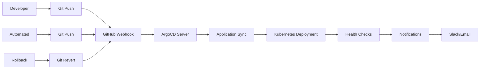

# VitalStream ArgoCD GitOps Platform

Production-ready GitOps platform with automated deployments, multi-environment support, and comprehensive monitoring.

## 🏥 Overview

VitalStream ArgoCD provides enterprise-grade GitOps automation for the VitalStream healthcare monitoring platform. This implementation includes automated deployments, multi-environment support, SSO integration, comprehensive RBAC, and production-ready monitoring.

## 📋 Table of Contents

- [Prerequisites](#prerequisites)
- [Quick Start](#quick-start)
- [Architecture](#architecture)
- [Configuration](#configuration)
- [Multi-Environment Support](#multi-environment-support)
- [Security](#security)
- [Monitoring](#monitoring)
- [Troubleshooting](#troubleshooting)
- [Best Practices](#best-practices)
- [Contributing](#contributing)

## 🚀 Prerequisites

### Required Software

- **Kubernetes** v1.24+ (tested on v1.28)
- **Helm** v3.8+
- **kubectl** v1.24+
- **ArgoCD CLI** v2.9+
- **Git** v2.30+

### Required Kubernetes Resources

- **Minimum Cluster**: 3 nodes, 8 vCPU, 32GB RAM
- **Recommended Cluster**: 5+ nodes, 16 vCPU, 64GB RAM
- **Storage Classes**: `fast-ssd`, `standard`
- **Ingress Controller**: NGINX Ingress Controller
- **Certificate Manager**: cert-manager v1.10+

### Optional Dependencies

- **Prometheus** v2.40+ (for monitoring)
- **Grafana** v9.0+ (for dashboards)
- **Vault** v1.12+ (for secret management)
- **Slack** workspace (for notifications)

## ⚡ Quick Start

### 1. Clone Repository

```bash
git clone https://github.com/vitalstream/vitalstream.git
cd vitalstream/infrastructure/argocd
```

### 2. Install ArgoCD

```bash
# Make installation script executable
chmod +x install-argocd.sh

# Run installation
./install-argocd.sh
```

### 3. Configure Git Repository

```bash
# Add Git repository with credentials
argocd repo add vitalstream \
  --repo https://github.com/vitalstream/vitalstream.git \
  --type git \
  --name vitalstream \
  --project vitalstream
```

### 4. Deploy Applications

```bash
# Apply project configuration
kubectl apply -f projects/vitalstream-project.yaml

# Deploy production application
kubectl apply -f applications/vitalstream-prod.yaml

# Deploy multi-environment applications
kubectl apply -f applicationsets/vitalstream-multi-env.yaml
```

### 5. Verify Installation

```bash
# Check ArgoCD server status
kubectl get pods -n argocd

# Get initial admin password
kubectl -n argocd get secret argocd-initial-admin-secret \
  -o jsonpath="{.data.password}" | base64 -d

# Access ArgoCD UI
echo "ArgoCD URL: https://argocd.vitalstream.com"
```

## 🏗️ Architecture

### Component Overview

```
┌─────────────────┐    ┌─────────────────┐    ┌─────────────────┐
│   GitHub Repo   │    │   ArgoCD Server │    │   Kubernetes    │
│   (Git Source)  │◄──►│   (Controller)  │◄──►│   (Cluster)     │
│                 │    │                 │    │                 │
│ - Helm Charts   │    │ - Application   │    │ - Deployments   │
│ - K8s Manifests│    │ - Sync Engine   │    │ - Services      │
│ - ConfigMaps    │    │ - Health Checks │    │ - Ingress       │
│ - Secrets      │    │ - Notifications │    │ - Monitoring    │
└─────────────────┘    └─────────────────┘    └─────────────────┘
         │                       │                       │
         │                       │                       │
         ▼                       ▼                       ▼
┌─────────────────┐    ┌─────────────────┐    ┌─────────────────┐
│     Slack       │    │     SSO/Dex    │    │     Vault       │
│  (Notifications)│    │  (Authentication)│    │ (Secret Mgmt)   │
│                 │    │                 │    │                 │
│ - Deployments   │    │ - OAuth2/OIDC   │    │ - Secrets       │
│ - Failures      │    │ - RBAC          │    │ - Certificates  │
│ - Health Status │    │ - Groups         │    │ - Keys          │
└─────────────────┘    └─────────────────┘    └─────────────────┘
```

### GitOps Workflow



## ⚙️ Configuration

### Core Configuration

#### ArgoCD Server Configuration

```yaml
# argocd-cm.yaml
apiVersion: v1
kind: ConfigMap
metadata:
  name: argocd-cm
  namespace: argocd
data:
  server.insecure: "false"
  server.baseurl: "https://argocd.vitalstream.com"
  dex.config: |
    connectors:
      - type: oidc
        id: oidc
        name: VitalStream SSO
        config:
          issuer: https://sso.vitalstream.com
          clientID: argocd
          clientSecret: $oidc.clientSecret
```

#### RBAC Configuration

```yaml
# argocd-rbac-cm.yaml
apiVersion: v1
kind: ConfigMap
metadata:
  name: argocd-rbac-cm
  namespace: argocd
data:
  policy.csv: |
    p, role:admin, applications, *, */*, allow
    p, role:developer, applications, *, vitalstream-dev/*, allow
    p, role:developer, applications, *, vitalstream-staging/*, allow
    p, role:developer, applications, get, vitalstream-prod/*, allow
    p, role:ops, applications, *, vitalstream-*, allow
    p, role:viewer, applications, get, vitalstream-*, allow
    g, vitalstream-admins, role:admin
    g, vitalstream-developers, role:developer
    g, vitalstream-ops, role:ops
    g, vitalstream-viewers, role:viewer
```

### Application Configuration

#### Production Application

```yaml
# applications/vitalstream-prod.yaml
apiVersion: argoproj.io/v1alpha1
kind: Application
metadata:
  name: vitalstream-prod
  namespace: argocd
spec:
  project: vitalstream
  source:
    repoURL: https://github.com/vitalstream/vitalstream.git
    targetRevision: main
    path: infrastructure/helm/vitalstream
    helm:
      valueFiles:
        - values-prod.yaml
  destination:
    server: https://kubernetes.default.svc
    namespace: vitalstream-prod
  syncPolicy:
    automated:
      prune: true
      selfHeal: true
```

#### Multi-Environment ApplicationSet

```yaml
# applicationsets/vitalstream-multi-env.yaml
apiVersion: argoproj.io/v1alpha1
kind: ApplicationSet
metadata:
  name: vitalstream-multi-env
  namespace: argocd
spec:
  generators:
  - list:
      elements:
      - cluster: in-cluster
        environments:
          - name: development
            namespace: vitalstream-dev
            valuesFile: values-dev.yaml
          - name: staging
            namespace: vitalstream-staging
            valuesFile: values-staging.yaml
          - name: production
            namespace: vitalstream-prod
            valuesFile: values-prod.yaml
```

## 🌍 Multi-Environment Support

### Environment Configuration

| Environment | Namespace | Branch | Sync Policy | Access Level |
|-------------|-----------|--------|-------------|--------------|
| Development | vitalstream-dev | develop | Automated | Full Access |
| Staging | vitalstream-staging | main | Automated | Full Access |
| Production | vitalstream-prod | main | Manual | Restricted Access |

### Sync Windows

```yaml
# Production sync windows (business hours)
syncWindows:
  - kind: allow
    schedule: '0 9 * * 1-5'  # Monday to Friday, 9 AM UTC
    duration: 8h
    namespaces:
      - vitalstream-prod
  - kind: deny
    schedule: '0 17 * * 1-5'  # Monday to Friday, 5 PM UTC
    duration: 16h
    namespaces:
      - vitalstream-prod
```

### Environment-Specific Features

#### Development Environment

- **Hot Reload**: Automatic deployment on every push
- **Mock Data**: Test data and services enabled
- **Debug Mode**: Verbose logging and debugging tools
- **Resource Limits**: Minimal resource allocation

#### Staging Environment

- **Automated Testing**: Integration and smoke tests
- **Performance Monitoring**: Load testing and metrics
- **Feature Flags**: Beta feature testing
- **Resource Allocation**: Moderate resources

#### Production Environment

- **Manual Approval**: Manual sync for production
- **Health Monitoring**: Comprehensive health checks
- **Rollback Capabilities**: Automated rollback on failure
- **Resource Allocation**: High availability resources

## 🔒 Security

### Authentication & Authorization

#### SSO Integration

```yaml
# OIDC Configuration
dex.config: |
  connectors:
    - type: oidc
      id: oidc
      name: VitalStream SSO
      config:
        issuer: https://sso.vitalstream.com
        clientID: argocd
        clientSecret: $oidc.clientSecret
        requestedScopes:
          - openid
          - profile
          - email
          - groups
```

#### RBAC Roles

| Role | Permissions | Use Case |
|------|-------------|----------|
| Admin | Full access to all resources | Platform administrators |
| Developer | Deploy to dev/staging, read prod | Development team |
| Ops | Manage all environments | Operations team |
| Viewer | Read-only access | Stakeholders, auditors |
| CI/CD | Automated deployments | CI/CD pipelines |

### Secret Management

#### Vault Integration

```yaml
# Vault Configuration
secret.management.enabled: "true"
secret.management.type: "vault"
secret.management.vault.address: "https://vault.vitalstream.com"
secret.management.vault.auth.method: "kubernetes"
secret.management.vault.auth.mountPath: "kubernetes"
secret.management.vault.auth.role: "argocd"
```

#### Git Repository Security

```bash
# SSH Key Configuration
argocd repo add vitalstream \
  --repo git@github.com:vitalstream/vitalstream.git \
  --ssh-private-key-path ~/.ssh/id_rsa \
  --type git \
  --project vitalstream

# Token-based Authentication
argocd repo add vitalstream \
  --repo https://github.com/vitalstream/vitalstream.git \
  --username vitalstream-bot \
  --password $GITHUB_TOKEN \
  --type git \
  --project vitalstream
```

## 📊 Monitoring

### Health Checks

```yaml
# Custom Health Checks
health:
  status: Healthy
  customHealthChecks:
    - name: backend-health
      check:
        http:
          url: https://api.vitalstream.com/health
          expectedStatus: 200
          timeoutSeconds: 30
    - name: frontend-health
      check:
        http:
          url: https://vitalstream.com/health
          expectedStatus: 200
          timeoutSeconds: 30
```

### Metrics Configuration

```yaml
# Metrics Configuration
metrics.enabled: "true"
metrics.applicationLabels.enabled: "true"
metrics.server.expose: "true"
metrics.server.path: "/metrics"
metrics.server.port: "8083"
```

### Prometheus Integration

```yaml
# ServiceMonitor for ArgoCD
apiVersion: monitoring.coreos.com/v1
kind: ServiceMonitor
metadata:
  name: argocd-metrics
  namespace: argocd
spec:
  selector:
    matchLabels:
      app.kubernetes.io/name: argocd-metrics
  endpoints:
  - port: metrics
    interval: 30s
    path: /metrics
```

### Notifications

#### Slack Integration

```yaml
# Notification Configuration
notifications.enabled: "true"
notifications.argocd.namespace: "argocd"

# Slack Configuration
service.slack: |
  token: $slack-token
  username: ArgoCD
  icon: :argo:
```

#### Notification Triggers

```yaml
# Notification Triggers
trigger.on-deployed: |
  - when: app.status.operationState.phase in ['Succeeded']
    send: [app-deployed]
trigger.on-health-degraded: |
  - when: app.status.health.status == 'Degraded'
    send: [app-health-degraded]
trigger.on-sync-failed: |
  - when: app.status.operationState.phase in ['Error', 'Failed']
    send: [app-sync-failed]
```

## 🧪 Testing

### PreSync Hooks

```yaml
# Database Backup Hook
apiVersion: batch/v1
kind: Job
metadata:
  name: db-backup-presync
  annotations:
    argocd.argoproj.io/hook: PreSync
    argocd.argoproj.io/hook-delete-policy: BeforeHookCreation
    argocd.argoproj.io/sync-wave: "-1"
spec:
  template:
    spec:
      containers:
      - name: backup
        image: postgres:15-alpine
        command:
          - sh
          - -c
          - |
            pg_dump $DATABASE_URL > /backup/backup-$(date +%Y%m%d-%H%M%S).sql
            aws s3 cp /backup/backup-*.sql s3://vitalstream-backups/
        env:
        - name: DATABASE_URL
          valueFrom:
            secretKeyRef:
              name: vitalstream-secrets
              key: database-url
        - name: AWS_ACCESS_KEY_ID
          valueFrom:
            secretKeyRef:
              name: vitalstream-secrets
              key: aws-access-key
        - name: AWS_SECRET_ACCESS_KEY
          valueFrom:
            secretKeyRef:
              name: vitalstream-secrets
              key: aws-secret-key
```

### PostSync Hooks

```yaml
# Smoke Test Hook
apiVersion: batch/v1
kind: Job
metadata:
  name: smoke-test-postsync
  annotations:
    argocd.argoproj.io/hook: PostSync
    argocd.argoproj.io/hook-delete-policy: HookSucceeded
    argocd.argoproj.io/sync-wave: "10"
spec:
  template:
    spec:
      containers:
      - name: smoke-test
        image: curlimages/curl:latest
        command:
          - sh
          - -c
          - |
            # Test frontend health
            curl -f https://vitalstream.com/health
            
            # Test backend health
            curl -f https://api.vitalstream.com/health
            
            # Test database connectivity
            curl -f https://api.vitalstream.com/health/database
            
            echo "All smoke tests passed!"
```

## 🔧 Troubleshooting

### Common Issues

#### 1. Application Sync Failed

```bash
# Check application status
argocd app get vitalstream-prod

# Check sync status
argocd app sync vitalstream-prod --dry-run

# Check application logs
argocd app logs vitalstream-prod

# Check resource status
kubectl get all -n vitalstream-prod
```

#### 2. Repository Access Issues

```bash
# Test repository access
argocd repo list

# Test repository connection
argocd repo vitalstream list

# Check repository credentials
kubectl get secret argocd-repo-creds -n argocd -o yaml
```

#### 3. Authentication Issues

```bash
# Check SSO configuration
argocd admin settings

# Test SSO login
argocd login sso.vitalstream.com --sso

# Check user permissions
argocd account list
```

#### 4. Health Check Failures

```bash
# Check application health
argocd app get vitalstream-prod

# Check resource health
kubectl get pods -n vitalstream-prod

# Check events
kubectl get events -n vitalstream-prod --sort-by='.lastTimestamp'
```

### Debug Commands

```bash
# Port forward to ArgoCD server
kubectl port-forward svc/argocd-server -n argocd 8080:443

# Access ArgoCD CLI
argocd login localhost:8080

# Check application details
argocd app get vitalstream-prod --refresh

# Force sync application
argocd app sync vitalstream-prod --force

# Rollback application
argocd app rollback vitalstream-prod
```

## 📈 Best Practices

### GitOps Best Practices

1. **Immutable Infrastructure**: Never modify resources directly in the cluster
2. **Version Control**: All configuration changes must go through Git
3. **Branch Strategy**: Use separate branches for different environments
4. **Commit Messages**: Use descriptive commit messages with issue references
5. **Pull Requests**: Require PR reviews for production changes

### Security Best Practices

1. **Least Privilege**: Grant minimum necessary permissions
2. **Secret Management**: Use external secret management (Vault)
3. **Network Policies**: Implement network segmentation
4. **Audit Logging**: Enable comprehensive audit logging
5. **Regular Updates**: Keep ArgoCD and dependencies updated

### Monitoring Best Practices

1. **Health Checks**: Implement comprehensive health checks
2. **Metrics Collection**: Collect all relevant metrics
3. **Alerting**: Set up appropriate alerts for failures
4. **Log Aggregation**: Centralize logs for analysis
5. **Performance Monitoring**: Monitor application performance

## 🔄 CI/CD Integration

### GitHub Actions Integration

```yaml
# .github/workflows/gitops.yml
name: GitOps Sync
on:
  push:
    branches: [main, develop]
  pull_request:
    branches: [main]

jobs:
  sync:
    runs-on: ubuntu-latest
    steps:
      - uses: actions/checkout@v3
      - name: Configure ArgoCD
        run: |
          argocd login ${{ secrets.ARGOCD_URL }} --username ${{ secrets.ARGOCD_USERNAME }} --password ${{ secrets.ARGOCD_PASSWORD }}
      - name: Sync Application
        run: |
          argocd app sync vitalstream-prod
```

### Automated Testing

```yaml
# Automated testing pipeline
name: Automated Testing
on:
  push:
    branches: [main]

jobs:
  test:
    runs-on: ubuntu-latest
    steps:
      - name: Deploy to Staging
        run: |
          argocd app sync vitalstream-staging
      
      - name: Run Integration Tests
        run: |
          # Run integration tests against staging
          npm run test:integration
      
      - name: Run Performance Tests
        run: |
          # Run performance tests
          npm run test:performance
      
      - name: Approve Production
        if: success()
        run: |
          # Auto-approve production deployment
          argocd app sync vitalstream-prod
```

## 📚 Documentation

### Additional Resources

- [ArgoCD Documentation](https://argo-cd.readthedocs.io/)
- [ArgoCD Best Practices](https://argo-cd.readthedocs.io/en/stable/operator-manual/best-practices/)
- [GitOps Patterns](https://argoproj.github.io/argo-cd/operator-manual/gitops-patterns/)
- [ArgoCD Security](https://argo-cd.readthedocs.io/en/stable/operator-manual/security/)

### Training Materials

- [ArgoCD Tutorial](https://argo-cd.readthedocs.io/en/stable/tutorial/)
- [GitOps Workshop](https://github.com/argoproj/argo-cd-examples)
- [Advanced ArgoCD](https://argo-cd.readthedocs.io/en/stable/operator-manual/advanced/)

## 🤝 Contributing

### Development Workflow

1. **Fork** the repository
2. **Create** a feature branch
3. **Make** your changes
4. **Test** locally with `argocd app sync --dry-run`
5. **Submit** a pull request

### Code Style

- Use 2 spaces for YAML indentation
- Follow Kubernetes naming conventions
- Add comments for complex configurations
- Include descriptions for all parameters

### Testing

```bash
# Validate configuration
argocd admin validate

# Test application sync
argocd app sync vitalstream-prod --dry-run

# Test hooks
kubectl apply -f hooks/ --dry-run=client
```

## 📄 License

This project is licensed under Apache License 2.0 - see the [LICENSE](LICENSE) file for details.

## 🆘 Support

For support and questions:

- **Email**: devops@vitalstream.com
- **Slack**: vitalstream-gitops.slack.com
- **Issues**: [GitHub Issues](https://github.com/vitalstream/vitalstream/issues)
- **Documentation**: [GitOps Docs](https://docs.vitalstream.com/gitops)

---

**Version**: 1.0.0  
**Last Updated**: 2024-01-18  
**Maintainer**: VitalStream DevOps Team
